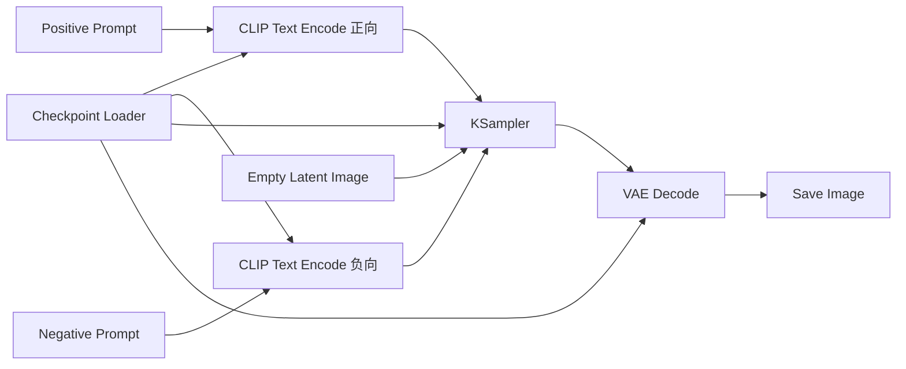

# Chapter 1：ComfyUI 第一阶段入门

本章的目标不是让你立刻变成“会搭复杂工作流的人”，而是先建立一套正确的认知框架。

如果你是 0 基础，请先记住一句话：

> ComfyUI 不是一个“填提示词然后点生成”的普通页面，它本质上是一个用节点图来组织生成流程的工作流系统。

学完本章，你应该能做到：

- 知道 ComfyUI 到底是什么
- 看懂节点、端口、连线、工作流这些基本概念
- 看懂一条最小的文生图流程
- 理解 `checkpoint`、`CLIP`、`VAE`、`KSampler` 在流程里的职责
- 能修改提示词、种子、步数、CFG 这些最基础参数

---

## 1. 第一阶段到底学什么

根据学习路线，第一阶段的目标是“建立整体认知”。

这一阶段不追求：

- 会写自定义节点
- 会做复杂 ControlNet 工作流
- 会做 API 集成
- 会做视频、音频、多模态工作流

这一阶段只追求三件事：

1. 认识 ComfyUI 的基本组成
2. 跑通最小文生图工作流
3. 理解核心节点之间的关系

如果你现在一看到一堆节点就头大，不知道谁连谁，这一章就是为你准备的。

---

## 2. ComfyUI 到底是什么

很多新手会把 ComfyUI 误认为：

- 一个“出图软件”
- 一个“提示词界面”
- 一个“Stable Diffusion 换皮工具”

这些理解都不够准确。

更准确的理解是：

> ComfyUI 是一个围绕生成式模型推理而设计的节点式工作流系统。

这里有几个关键词必须理解。

### 2.1 什么叫“节点式”

你不是在一个表单里填写所有参数，而是把整个生成过程拆成多个小模块，每个模块就是一个节点。

例如一张图的生成过程可以拆成：

- 加载模型
- 编码正向提示词
- 编码负向提示词
- 创建初始 latent
- 采样去噪
- VAE 解码
- 保存图像

每个步骤都可以单独看见、单独修改、单独连接。

### 2.2 什么叫“工作流”

工作流就是“这些节点如何组织起来完成任务”的方式。

不是单个节点重要，而是：

- 谁先执行
- 谁依赖谁
- 数据从哪里来
- 结果流到哪里去

所以在 ComfyUI 里，真正的核心不是“某个神奇参数”，而是“数据流和依赖关系”。

### 2.3 什么叫“推理系统”

生成图片不是凭空出现的。背后是一整条推理链：

- 模型加载
- 文本编码
- 潜空间采样
- 图像解码
- 文件输出

ComfyUI 把这条链显式展示给你，所以它学习门槛更高，但也更透明、更可控、更适合复现和扩展。

---

## 3. 新手最先要建立的心智模型

学习 ComfyUI，最重要的是不要一开始就死记节点名字。

你要先建立这样一个脑中模型：

```text
输入信息 -> 被节点处理 -> 结果传给下游节点 -> 最终得到图像
```

也就是说，ComfyUI 本质上是在描述一条“数据流”。

你可以把它想成一条装配线：

- 上游节点负责准备材料
- 中间节点负责计算和转换
- 下游节点负责生成最终结果

如果没有这个思维方式，你会经常遇到这些问题：

- 不知道为什么两个节点不能连
- 不知道为什么删了某个节点整张图就跑不起来
- 不知道某个参数改完为什么影响全图
- 不知道哪个节点负责模型，哪个节点负责出图

---

## 4. 最核心的四个基础概念

第一阶段必须吃透四个概念：

- 节点
- 端口
- 连线
- 工作流

### 4.1 节点是什么

节点可以理解成一个“最小功能块”。

它像一个小工具，负责做一件明确的事。

例如：

- `CheckpointLoaderSimple` 负责加载模型
- `CLIP Text Encode` 负责把提示词编码成模型能理解的条件
- `Empty Latent Image` 负责创建初始 latent
- `KSampler` 负责执行采样去噪
- `VAE Decode` 负责把 latent 转成图像
- `Save Image` 负责保存图片

所以你可以把节点理解为：

> 一个带输入、带输出、带参数、能执行某种功能的小模块

### 4.2 端口是什么

端口是节点左右两边那些可以连接的“接口”。

通常来说：

- 输入端口：表示“我需要什么”
- 输出端口：表示“我能产出什么”

举个例子：

- `KSampler` 需要模型、条件、latent 和采样参数
- 所以这些就是它的输入
- `KSampler` 产出新的 latent
- 这就是它的输出

你可以把端口理解成插座和插头。

### 4.3 连线是什么

连线不是装饰，它表示真实的数据依赖关系。

当你把一个节点的输出连到另一个节点的输入，本质上是在说：

> “上游节点的结果，作为下游节点的输入。”

例如：

- `CheckpointLoaderSimple` 输出 `model`
- 把 `model` 连给 `KSampler`
- 意思就是让 `KSampler` 使用这个模型来采样

所以连线不是随便画的，它决定了执行顺序。

### 4.4 工作流是什么

工作流就是“一组节点和它们的连接关系”。

一个工作流至少要回答四个问题：

1. 有哪些节点
2. 每个节点参数是什么
3. 谁连接到谁
4. 最终输出是什么

所以 ComfyUI 里的工作流，不是“操作记录”，而是“可执行结构”。

---

## 5. 为什么 ComfyUI 比传统 WebUI 更难，但也更强

传统参数面板式 WebUI 的思路是：

- 选择模型
- 填提示词
- 填参数
- 点生成

这种方式对新手友好，但很多中间过程是隐藏的。

ComfyUI 不一样。它把生成链条拆开给你看，所以你会直接看到：

- 模型是在哪里加载的
- 提示词是在哪里编码的
- latent 是怎么生成的
- 采样在哪一步发生
- 图像是怎么解码输出的

这就是为什么 ComfyUI 更适合：

- 学习生成模型的真实流程
- 复现别人分享的工作流
- 构建复杂图像处理链路
- 后续做自动化和工程化扩展

第一阶段你不需要掌握它的全部能力，但要先理解它为什么长成这样。

---

## 6. 最小文生图工作流：先看全貌

第一阶段最重要的实战对象，就是“最小文生图工作流”。

它通常可以抽象成下面这条链路：



第一次看这张图，你不需要记所有名字，先只记住它在做什么：

1. 先加载模型
2. 再理解提示词
3. 再准备一个初始 latent
4. 再通过采样把 latent 一步步变成结果
5. 最后把 latent 解码成图片并保存

如果你能把这五步讲明白，你就已经跨出第一阶段最关键的一步了。

---

## 7. 这条最小工作流到底在做什么

下面按执行逻辑拆解。

### 7.1 第一步：加载 checkpoint

你可以把 `checkpoint` 理解成“基础模型包”。

它通常不是只包含一个东西，而是会提供几类关键资源：

- `model`：真正参与扩散采样的模型主体
- `clip`：用于理解提示词的文本编码器
- `vae`：用于在 latent 和图像之间转换的编解码器

所以当你加载一个 checkpoint 时，你并不是只拿到“一个模型文件”，而是在拿一组后续节点要用的核心资源。

这是新手非常容易忽略的一点。

很多人以为：

> checkpoint = 最终负责出图的一切

更准确的理解应该是：

> checkpoint 是整个文生图链路的资源入口，它给后面的文本编码、采样和解码提供基础能力。

### 7.2 第二步：把提示词交给 CLIP

模型不能直接理解你写的自然语言句子。

所以提示词要先经过 `CLIP` 文本编码器处理，变成模型能利用的条件表示。

这里通常有两条分支：

- 正向提示词：告诉模型“尽量生成什么”
- 负向提示词：告诉模型“尽量不要生成什么”

对应地，通常会有两个 `CLIP Text Encode` 节点：

- 一个编码正向提示词
- 一个编码负向提示词

这一步的输出不是图片，而是“条件”。

你可以把它理解成：

- 提示词本身是人类语言
- 编码之后才变成模型可用的控制信息

### 7.3 第三步：创建初始 latent

`Empty Latent Image` 这个节点是新手很容易困惑的地方。

你可能会问：

“既然我要生成图片，为什么不直接创建一张空白图片？”

原因是扩散模型的主要计算过程并不是直接在像素图上完成的，而是在 `latent` 空间里完成的。

`latent` 可以理解成一种压缩后的内部表示。

它的特点是：

- 不是最终可见图像
- 更适合模型进行高效计算
- 是采样器真正处理的主要对象

所以文生图不是：

```text
文字 -> 直接得到图片
```

而更接近：

```text
文字条件 + 初始 latent -> 采样后的 latent -> 解码成图片
```

### 7.4 第四步：KSampler 执行采样

`KSampler` 是最核心的节点之一。

可以先把它粗略理解成：

> 它根据模型、提示词条件和随机起点，反复迭代，把一份初始 latent 逐步变成更符合要求的 latent。

它通常会接收这些关键输入：

- `model`
- `positive conditioning`
- `negative conditioning`
- `latent image`
- `seed`
- `steps`
- `cfg`
- `sampler_name`
- `scheduler`

这一层是整条链路里最像“真正生成”的部分。

### 7.5 第五步：VAE Decode 解码

采样结束后，`KSampler` 输出的仍然不是最终图片，而是处理后的 latent。

要把它变成你能看到的图像，还需要经过 `VAE Decode`。

所以：

- `KSampler` 输出的是潜空间结果
- `VAE Decode` 把潜空间结果转成像素图

如果没有这一步，你拿到的只是模型内部表示，不是图片文件。

### 7.6 第六步：保存图片

最后 `Save Image` 会把结果写到输出目录。

这一步虽然简单，但它标志着整条链的结束：

- 前面的节点主要负责“计算”
- 最后的保存节点负责“落地”

很多时候，只有能流到输出节点的那一支工作流，才真正有意义。

---

## 8. 第一阶段必须理解的四个核心组件

学习路线里特别点名了四个东西：

- `checkpoint`
- `CLIP`
- `VAE`
- `KSampler`

这四个组件必须吃透。

## 8.1 Checkpoint：资源总入口

`checkpoint` 是基础模型权重包。

对新手来说，先记住它在工作流中的作用：

- 决定你用的是哪套基础模型能力
- 提供采样要用的 `model`
- 提供提示词编码要用的 `clip`
- 提供图像编解码要用的 `vae`

如果你把它删掉，后续很多节点都没有资源可用。

你可以把它想成一座总仓库。

## 8.2 CLIP：把文字变成模型能理解的条件

`CLIP` 的核心作用不是“生成图片”，而是“理解提示词”。

它负责把：

- 正向提示词
- 负向提示词

转换成采样器可以使用的条件信息。

所以 CLIP 的职责是“语言理解和条件编码”，不是直接出图。

## 8.3 KSampler：真正执行去噪采样

`KSampler` 是生成过程的核心发动机。

它做的事情不是“一次性出图”，而是多轮迭代。

你可以把它理解成：

- 从一个随机起点开始
- 参考提示词条件
- 一步一步把随机内容收敛成更符合目标的结果

所以它通常是影响风格、细节、稳定性、速度的重要节点。

## 8.4 VAE：负责 latent 和 image 的互相转换

很多新手第一次接触 ComfyUI 时，最大的陌生点就是 `latent`。

这时候一定要记住：

- 模型内部主要处理的是 latent
- 人类最终看到的是 image
- `VAE` 就是这两者之间的桥梁

没有 `VAE`，你就很难理解为什么工作流里老是在说 encode / decode。

---

## 9. 你必须知道的两个“看不见”的概念

第一阶段还有两个容易被忽略，但非常重要的概念：

- conditioning
- latent

### 9.1 Conditioning：条件

`conditioning` 可以简单理解成“告诉模型该往哪个方向生成的信息”。

它可以来自：

- 正向提示词
- 负向提示词
- 参考图
- 结构控制
- 掩码

第一阶段你先只需要理解文本条件即可。

也就是说：

- CLIP 编码之后得到的是条件
- KSampler 使用这些条件控制生成方向

### 9.2 Latent：潜空间表示

`latent` 不是图片本身，但它和图片强相关。

你可以把它理解成一种“压缩后的图像表示”。

它存在的意义是：

- 降低计算成本
- 让采样更高效
- 方便做重绘、放大、局部编辑等操作

只要你能接受“模型内部并不是直接在像素图上工作”，就已经理解了一大半。

---

## 10. 第一阶段最常改的四个参数

学习路线里提到，第一阶段至少要能改：

- 提示词
- 种子
- 步数
- CFG

下面分别解释。

### 10.1 提示词 Prompt

提示词决定你想让模型朝什么内容生成。

初学时你只要先理解：

- 正向提示词：你想要什么
- 负向提示词：你不想要什么

不要一开始就迷信“超长咒语提示词”。

第一阶段更重要的是学会观察：

- 提示词改了，哪个节点受影响
- 为什么改提示词后采样结果会变

### 10.2 Seed：随机种子

`seed` 决定随机起点。

通俗一点说：

- 同样的流程、同样的参数、同样的模型
- 如果 seed 一样，结果通常更容易复现
- 如果 seed 变了，图像构图和细节也可能明显变化

所以 seed 是“复现性”的关键参数。

### 10.3 Steps：采样步数

`steps` 是采样迭代次数。

直观理解：

- 步数更少，速度通常更快
- 步数更高，可能有更多细节
- 但并不是无限增加就一定更好

第一阶段你不需要研究采样数学原理，只需要建立最朴素的认识：

> `steps` 是质量和速度之间的重要平衡参数。

### 10.4 CFG：提示词引导强度

`CFG` 可以先理解成“模型有多听提示词的话”。

粗略来说：

- 太低，模型可能不够贴合提示词
- 太高，模型可能变得生硬、失真或不自然

第一阶段你不必追求精确理解它的数学意义，只要知道它控制“提示词约束强度”即可。

---

## 11. 你应该如何阅读一个工作流

新手常见错误是“盯着单个节点看”，结果越看越乱。

更好的阅读方法是按下面顺序。

### 11.1 先找输出节点

先看最后是谁在输出结果。

常见是：

- `Save Image`
- `Preview Image`

找到输出节点后，沿着它的输入往回追。

### 11.2 再找采样节点

大多数基础工作流里，核心执行节点通常是：

- `KSampler`

先看它需要什么输入，就能快速理解整条链路。

### 11.3 再找模型来源

问自己：

- 这个 `model` 从哪里来
- 这个 `clip` 从哪里来
- 这个 `vae` 从哪里来

很多时候答案都能追到 `Checkpoint Loader`。

### 11.4 再找条件来源

看正向和负向条件从哪里来。

一般是：

- 提示词文本
- `CLIP Text Encode`

### 11.5 最后看参数节点

基础参数如：

- 宽高
- seed
- steps
- cfg

这些通常决定图像行为，但不是最先该看的部分。

先把“结构”看懂，再看“参数”。

---

## 12. 第一阶段最容易犯的误区

### 12.1 只记名字，不理解数据流

你可能背下了很多节点名字，但一旦换个工作流还是看不懂。

原因是你记住的是标签，不是关系。

真正要理解的是：

- 这个节点吃什么输入
- 这个节点吐出什么输出
- 它为什么接在这里

### 12.2 只关注提示词，不理解模型装配

ComfyUI 的强大不只是 prompt。

更关键的是：

- 模型怎么接
- 条件怎么进
- latent 怎么流动
- 采样怎么执行

### 12.3 看到复杂图就慌

复杂图本质上也是由基础模块拼出来的。

只要你掌握了最小文生图链路，后面无非是在这条链路上增加：

- 更多条件
- 更多分支
- 更多后处理

### 12.4 把每个参数都当成玄学

第一阶段不要陷入“这个参数到底调 7 还是 7.5”的焦虑。

你现在更应该知道的是：

- 参数属于哪个节点
- 参数影响哪一段流程
- 修改它为什么会让某些节点重算

---

## 13. 你现在就应该会说出的那段话

如果你学完本章，应该能用自己的话说出下面这段逻辑：

> 我先加载 checkpoint，拿到 model、clip、vae。  
> 然后把正向和负向提示词交给 CLIP 编码，得到条件。  
> 接着创建一个初始 latent，交给 KSampler。  
> KSampler 会结合模型、条件、seed、steps、cfg 等参数进行采样，产出新的 latent。  
> 最后用 VAE 把 latent 解码成图片，再保存输出。

如果你能顺畅讲清这段话，说明你已经真正理解了第一阶段的核心。

---

## 14. 给 0 基础学习者的建议学习顺序

请按这个顺序学，不要跳。

1. 先认识节点、端口、连线、工作流
2. 再观察最小文生图链路
3. 再理解 `checkpoint / CLIP / VAE / KSampler`
4. 再尝试改提示词、seed、steps、cfg
5. 最后再去看更复杂的工作流

顺序很重要。

如果你跳过前两步，后面看到：

- LoRA
- ControlNet
- IPAdapter
- inpaint
- upscale

你会很容易彻底混乱。

---

## 15. 本章学习任务

下面是你在第一阶段应该完成的最小练习。

### 练习 1：识别最小工作流里的角色

看到一条最小文生图工作流时，能指出：

- 谁负责加载模型
- 谁负责编码提示词
- 谁负责创建 latent
- 谁负责采样
- 谁负责解码
- 谁负责保存

### 练习 2：只改提示词

目标：

- 不改其他参数
- 只改正向和负向提示词
- 观察结果变化

你要建立的意识是：

- 提示词变化会影响条件
- 条件变化会影响采样结果

### 练习 3：只改 seed

目标：

- 保持模型、提示词、步数、CFG 不变
- 只改 seed

观察重点：

- 构图会不会变
- 细节会不会变
- 风格大方向是否仍然保留

### 练习 4：只改 steps

目标：

- 只比较不同步数对速度和结果的影响

你不用追求绝对结论，只要形成这种思维：

- 步数影响采样过程
- 步数影响耗时

### 练习 5：只改 CFG

目标：

- 保持其他参数不变
- 观察 CFG 对“贴合提示词程度”的影响

---

## 16. 第一阶段完成标准

如果你已经能做到下面这些，就说明第一阶段基本达标：

- 能解释 ComfyUI 是工作流系统，不只是出图页面
- 能看懂节点、端口、连线、工作流的含义
- 能看懂最小文生图链路
- 能解释 `checkpoint / CLIP / VAE / KSampler` 分别干什么
- 能自己改提示词、seed、steps、cfg
- 能顺着连线说出数据从哪里来、到哪里去

如果你还做不到，也没关系，继续反复读第 6 到第 10 节。

对新手来说，真正的门槛不是操作，而是“脑子里有没有形成那条链路”。

---

## 17. 本章总结

第一阶段不是在追求“高级技巧”，而是在打地基。

请再次记住三个最重要的结论：

1. ComfyUI 是工作流系统，不是单纯的提示词界面
2. 节点之间的连线表示真实的数据依赖
3. 最小文生图链路的核心是 `checkpoint -> CLIP -> latent -> KSampler -> VAE -> Save`

你后面学到的几乎所有高级能力，都会建立在这条基础链路上。

下一步如果继续学习，最合理的方向就是进入第二阶段：

- `txt2img`
- `img2img`
- `inpaint`
- `upscale`

但在进入下一阶段之前，请先确保你真的看懂了这一章。
