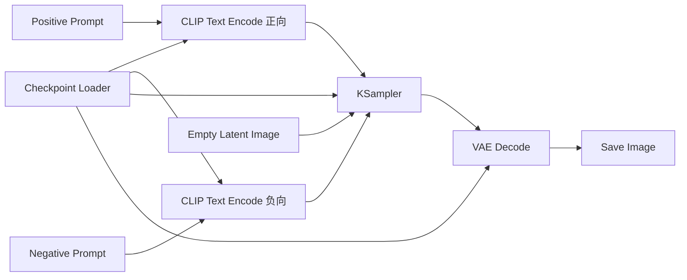
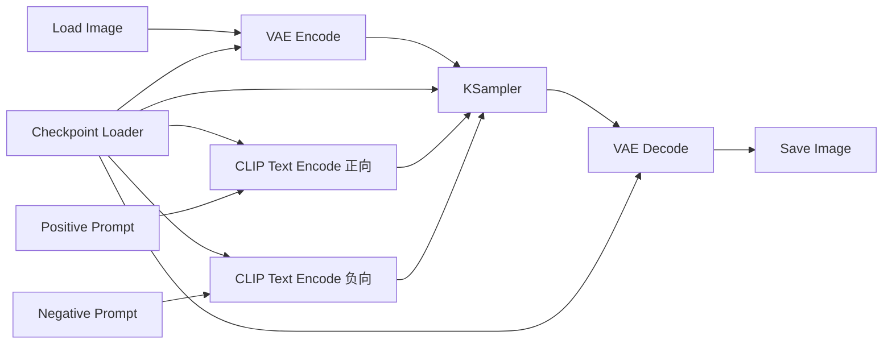
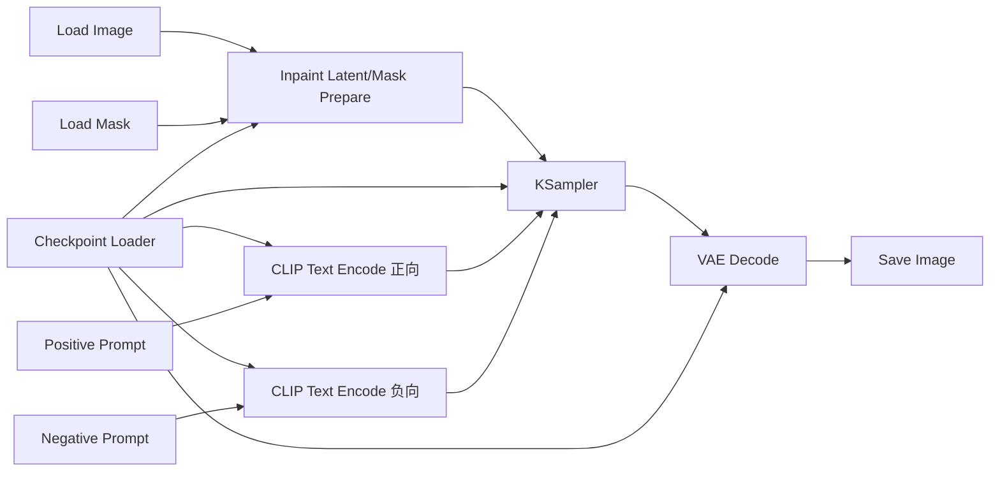
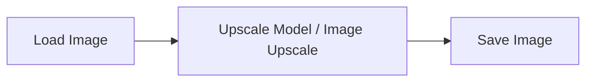
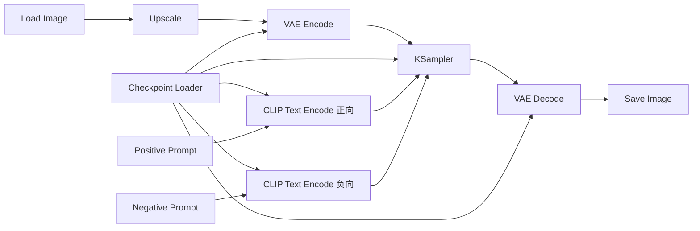

# Chapter 2：ComfyUI 第二阶段基础工作流

如果说第一阶段是在建立“ComfyUI 是什么”的整体认知，那么第二阶段就是开始真正掌握最常见、最实用的基础工作流。

这一章的核心目标不是让你马上学会复杂控制，而是让你能从零看懂并搭出四类最基础的流程：

- `txt2img`
- `img2img`
- `inpaint`
- `upscale`

学完本章，你应该能做到：

- 明白四类基础工作流分别解决什么问题
- 能看懂它们的核心链路和节点职责
- 能判断什么时候该用哪一种工作流
- 能自己从零搭一套基础出图图谱
- 能解释每个关键节点在链路中的作用

---

## 1. 第二阶段到底在学什么

根据学习路线，第二阶段叫做“掌握基础工作流”。

它和第一阶段的区别是：

- 第一阶段重点是建立认知
- 第二阶段重点是开始真正搭图和改图

第一阶段你主要理解：

- 节点
- 端口
- 连线
- 工作流
- `checkpoint / CLIP / VAE / KSampler`

第二阶段你要开始回答更具体的问题：

- 什么时候用 `txt2img`
- 什么时候用 `img2img`
- 为什么 `img2img` 要先 `VAE Encode`
- `inpaint` 为什么必须有 `mask`
- `upscale` 为什么有时不只是“放大图片”

换句话说，第二阶段是在把“抽象认知”变成“可以动手搭建的基础能力”。

---

## 2. 这四类工作流分别在解决什么问题

先不要急着记节点。先把用途区分清楚。

| 工作流 | 解决的问题 | 输入是什么 | 输出是什么 | 最适合的场景 |
| --- | --- | --- | --- | --- |
| `txt2img` | 从文字直接生成图像 | 提示词、模型、采样参数 | 全新图像 | 从 0 开始生成 |
| `img2img` | 基于已有图像重新生成 | 输入图像、提示词、采样参数 | 保留部分原图特征的新图 | 改风格、改细节、改构图但保留基础 |
| `inpaint` | 只修改图像局部区域 | 输入图像、遮罩、提示词 | 局部修改后的图像 | 修脸、换衣服、补背景、局部替换 |
| `upscale` | 提高分辨率和细节 | 输入图像 | 更大、更清晰的图像 | 成品细化、打印、高清输出 |

这张表非常重要。

很多新手最大的问题不是不会连节点，而是根本没有先判断：

> 我现在想解决的是“从 0 生成”，还是“基于已有结果修改”？

只要这个判断错了，后面整个工作流方向都会错。

---

## 3. 四类工作流背后的共同骨架

虽然这四类流程用途不同，但底层骨架其实很像。

几乎所有基础工作流，都绕不开这几个角色：

- `Checkpoint Loader`
- `CLIP Text Encode`
- `KSampler`
- `VAE Encode / Decode`
- `Save Image`

真正的变化主要发生在两个地方：

1. 输入的起点不一样
2. 采样前送给 `KSampler` 的 latent 不一样

你可以先把四类流程粗略理解成这样：

```text
txt2img:   文字 + 空 latent -> 采样 -> 解码 -> 输出
img2img:   图像 -> 编码成 latent -> 采样 -> 解码 -> 输出
inpaint:   图像 + mask -> 局部编码/局部采样 -> 解码 -> 输出
upscale:   图像 -> 放大/重采样/增强 -> 输出
```

这一章最核心的任务，就是把这四条路径彻底讲明白。

---

## 4. txt2img：从 0 生成一张新图

`txt2img` 是第二阶段里最基础的工作流，也是整个 ComfyUI 世界的起点。

### 4.1 txt2img 在做什么

它解决的问题非常直接：

> 根据提示词，从零开始生成一张全新的图像。

它没有输入参考图，也没有局部遮罩。

它依赖的核心是：

- 模型能力
- 提示词条件
- 随机起点
- 采样过程

### 4.2 txt2img 的最小链路



如果你已经学过第一章，这张图应该不陌生。

第二阶段对你的要求不是“看过”，而是：

> 你要能自己搭出来，并且知道每根线为什么这样接。

### 4.3 txt2img 的关键节点职责

#### `Checkpoint Loader`

负责提供：

- `model`
- `clip`
- `vae`

这是整条链的资源入口。

#### `CLIP Text Encode`

负责把：

- 正向提示词
- 负向提示词

转成可供采样使用的条件。

#### `Empty Latent Image`

负责创建一个“空的 latent 容器”。

它通常决定：

- 宽度
- 高度
- batch size

这个节点很关键，因为它实际上决定了输出图像的基础尺寸。

#### `KSampler`

负责真正的采样去噪。

这是“生成行为”发生的地方。

#### `VAE Decode`

负责把采样后的 latent 转成你能看见的图像。

#### `Save Image`

负责把图像保存下来。

### 4.4 txt2img 最关键的参数

新手先重点盯住这几个：

- `prompt`
- `negative prompt`
- `seed`
- `steps`
- `cfg`
- `width`
- `height`

这些参数里：

- `prompt` 决定内容方向
- `seed` 决定随机起点
- `steps` 决定采样迭代次数
- `cfg` 决定提示词约束强度
- `width / height` 决定生成尺寸

### 4.5 txt2img 适合什么场景

适合：

- 从零创作
- 测试模型风格
- 尝试提示词
- 生成第一版草图

不适合：

- 保留一张现有图片的大致结构
- 只修改局部区域
- 单纯做清晰度提升

如果你手里已经有一张图，还想尽量保留它的轮廓和布局，那通常就不该优先考虑 `txt2img`。

### 4.6 学 txt2img 时最容易犯的错

#### 错误 1：只看提示词，不看尺寸

很多新手只会改 prompt，却忽略了：

- 输出尺寸会影响构图
- 输出尺寸会影响显存
- 输出尺寸会影响细节密度

#### 错误 2：不理解 `Empty Latent Image`

如果你不知道这个节点在干什么，就很难真正理解为什么文生图不需要输入图片，却仍然能开始采样。

#### 错误 3：把 `seed` 当成无关紧要

`seed` 是复现工作流结果的重要前提。

如果你完全不记录 seed，你就很难复现同一张图的风格和构图。

---

## 5. img2img：基于已有图像重新生成

`img2img` 是第二阶段非常关键的一步，因为它让你第一次真正看到：

> 不是所有工作流都从空 latent 开始。

### 5.1 img2img 在做什么

`img2img` 解决的问题是：

> 以一张已有图像为基础，让模型重新采样，得到一张保留原图某些特征但又发生变化的新图。

你可以把它理解成：

- 不是完全重画
- 也不是简单滤镜
- 而是“参考原图后重新生成”

### 5.2 img2img 的核心变化

和 `txt2img` 最大的不同在于：

- `txt2img` 使用 `Empty Latent Image`
- `img2img` 使用“输入图像 -> `VAE Encode` -> latent”

也就是说，`img2img` 先把现有图像编码进潜空间，再交给采样器继续处理。

### 5.3 img2img 的典型链路



### 5.4 img2img 为什么要先 `VAE Encode`

这是第二阶段必须真正理解的一点。

原因很简单：

- 模型采样主要在 latent 空间工作
- 输入图像最开始是像素图
- 所以要先把像素图编码成 latent

这个过程就是：

```text
image -> VAE Encode -> latent
```

然后采样结束后再：

```text
latent -> VAE Decode -> image
```

这就是为什么 `img2img` 工作流里常常同时看到：

- `VAE Encode`
- `KSampler`
- `VAE Decode`

### 5.5 img2img 的关键参数：`denoise`

如果说 `txt2img` 的关键理解点是 `Empty Latent Image`，那么 `img2img` 的关键理解点就是 `denoise`。

你可以把 `denoise` 粗略理解为：

> 模型要对原图“改动多大”。

大致上可以这样理解：

- `denoise` 较低：更保留原图结构和细节
- `denoise` 较高：变化更大，更接近重新生成

所以 `img2img` 的核心其实就是在控制：

- 原图保留多少
- 模型重绘多少

### 5.6 img2img 适合什么场景

适合：

- 改变图像风格
- 增强某些细节
- 在原有构图基础上重新演绎
- 让草图变得更完整

不适合：

- 只改动很小的局部区域
- 需要严格锁定未修改区域

如果你只是想换脸上的一个小瑕疵，直接用 `img2img` 往往会影响整张图。这时通常更适合 `inpaint`。

### 5.7 img2img 最容易犯的错

#### 错误 1：把它当成“套滤镜”

`img2img` 不是传统图片编辑里的滤镜，它本质上仍然是在重新采样。

#### 错误 2：不知道为什么结果变化太大

大多数时候，罪魁祸首是：

- `denoise` 太高
- prompt 改动太大
- seed 变化太大

#### 错误 3：用错工作流

如果目标只是局部替换，不应优先使用整图 `img2img`。

---

## 6. inpaint：只修改图像的一部分

`inpaint` 是第二阶段最容易让新手既兴奋又混乱的一类流程。

因为它第一次引入了一个非常重要的概念：

> 不是整张图都要重算，只有指定区域需要重点修改。

### 6.1 inpaint 在做什么

`inpaint` 解决的问题是：

> 在保留图像大部分内容的前提下，只对指定区域进行重新生成或修补。

典型场景包括：

- 修复脸部细节
- 替换衣服
- 修改手部
- 补背景
- 去掉多余物体
- 给空白区域补内容

### 6.2 inpaint 的核心新增：`mask`

和 `img2img` 相比，`inpaint` 最大的区别就是多了 `mask`。

`mask` 可以简单理解成：

- 白色区域：需要修改
- 黑色区域：尽量保留

不同节点或工作流对黑白含义的具体定义可能略有差异，但核心思想始终一样：

> 用一张遮罩图告诉系统，哪里该重绘，哪里该保留。

### 6.3 inpaint 的核心逻辑

先用一句话概括：

> `inpaint` = 图像输入 + 遮罩限制 + 局部重绘采样

和 `img2img` 不同的是，它不是对整张图平均施加变化，而是重点针对遮罩区域做处理。

### 6.4 inpaint 的典型链路

不同节点包会有不同实现，但逻辑上通常会长这样：



注意：

- 具体节点名在不同版本或节点包里可能不同
- 但“图像 + mask + 编码/准备 + 局部采样 + 解码”的逻辑不会变

### 6.5 为什么 inpaint 比 img2img 更适合局部修改

因为 `img2img` 的默认思路是：

- 整张图一起进入采样

而 `inpaint` 的思路是：

- 用 `mask` 把修改范围限制住
- 重点只处理目标区域

所以当你的需求是：

- 只改眼睛
- 只换衣服
- 只补背景一角

那么 `inpaint` 通常比整图 `img2img` 更稳定、更可控。

### 6.6 inpaint 的关键理解点

#### 关键点 1：遮罩质量决定结果质量

如果你的遮罩：

- 边缘太硬
- 区域太大
- 区域太小
- 涂抹不准确

最终结果就会很容易：

- 接缝明显
- 风格不一致
- 修改不充分
- 误伤原图

#### 关键点 2：提示词要聚焦局部目标

当你只修改局部时，提示词不应该还在描述整张图的所有内容。

更有效的方式往往是：

- 保留必要的整体语境
- 重点描述要修改的区域和目标

#### 关键点 3：局部修改并不等于绝对不影响周边

即使是 `inpaint`，采样过程中也可能对邻近区域产生影响。

所以 `inpaint` 不是“像 PS 一样像素级绝对锁死”，而是“更有针对性的局部生成”。

### 6.7 inpaint 最容易犯的错

#### 错误 1：遮罩范围画太大

遮罩太大，意味着需要模型重画的区域过多，稳定性会下降。

#### 错误 2：遮罩范围画太小

遮罩太小，模型没有足够空间做自然过渡，就容易出现边缘不协调。

#### 错误 3：把整图修改问题硬塞给 inpaint

如果你想整体换风格、整体重构图，`inpaint` 往往不是最高效的选择。

---

## 7. upscale：放大与细化

`upscale` 是第二阶段里最容易被低估的一类工作流。

很多新手把它理解成“把图片尺寸拉大”，但在 ComfyUI 里，`upscale` 往往不仅仅是插值放大。

它常常和细节增强、重采样结合在一起。

### 7.1 upscale 在做什么

`upscale` 解决的问题是：

> 让图像变得更大、更清晰，或者在放大后仍然保持较好的细节质量。

这类流程通常出现在：

- 最终成品导出前
- 需要高分辨率打印
- 原图太小但想保留可用细节
- 低分辨率草图需要做成更精细的结果

### 7.2 两种常见 upscale 思路

#### 思路 1：纯放大

这类流程主要是：

- 读取图片
- 使用放大模型或插值算法
- 输出更大的图片

优点：

- 简单
- 快
- 不容易改变原图内容

缺点：

- 只能有限增强细节
- 很难凭空创造高质量新细节

#### 思路 2：放大后再重采样

这类流程通常是：

- 先把图像放大
- 再转入 latent 或继续采样
- 对细节做进一步增强

优点：

- 更容易补细节
- 更适合做高质量成品

缺点：

- 更吃显存
- 更容易引入内容变化

### 7.3 upscale 的典型链路

最简单的纯放大逻辑可以理解成：



而更常见的“放大 + 重采样增强”逻辑则更接近：



### 7.4 为什么 upscale 不只是“拉伸尺寸”

因为真正高质量的放大，难点不是把像素变多，而是：

- 放大后细节是否自然
- 纹理是否真实
- 边缘是否干净
- 人脸、头发、服装等是否仍然稳定

所以 ComfyUI 里的 `upscale` 经常会和：

- 放大模型
- `img2img`
- 低强度重采样

一起使用。

### 7.5 upscale 适合什么场景

适合：

- 最终出成品前做清晰度提升
- 小图变大图
- 海报、打印、高清展示

不适合：

- 完全改变画面内容
- 大幅重构构图
- 精准局部替换

### 7.6 upscale 最容易犯的错

#### 错误 1：以为放大一定等于更清晰

如果原图信息太少，单纯放大只会把模糊一起放大。

#### 错误 2：放大后重采样过强

如果后续重采样强度太高，就可能把原图内容改坏。

#### 错误 3：忽略显存和尺寸成本

放大意味着更大的数据尺寸，也意味着：

- 更高显存占用
- 更慢速度
- 更容易爆内存

---

## 8. 四类工作流的本质区别

学到这里，你应该不只是“知道有四种工作流”，而是能分清它们的本质差异。

### 8.1 起点不同

- `txt2img`：从空 latent 开始
- `img2img`：从现有图像编码成 latent 开始
- `inpaint`：从图像和局部遮罩开始
- `upscale`：从已有图像放大和增强开始

### 8.2 控制粒度不同

- `txt2img`：整体生成
- `img2img`：整体重采样但保留部分原图
- `inpaint`：局部区域重采样
- `upscale`：以分辨率和细节增强为主

### 8.3 关注参数不同

- `txt2img`：`seed / steps / cfg / width / height`
- `img2img`：在上面的基础上更关注 `denoise`
- `inpaint`：更关注 `mask` 质量、区域范围、局部控制
- `upscale`：更关注放大倍率、放大模型、后续增强强度

---

## 9. 你应该如何从零搭一套基础出图图谱

第二阶段的产出标准之一是：

> 能自己从零搭一套基础出图图谱。

这里的关键不是一下子搭出复杂大图，而是先形成“基础模板思维”。

### 9.1 先搭最小 txt2img 模板

你应该先能从空白画布搭出：

- `Checkpoint Loader`
- 两个 `CLIP Text Encode`
- `Empty Latent Image`
- `KSampler`
- `VAE Decode`
- `Save Image`

这是所有后续流程的母模板。

### 9.2 再从 txt2img 改造成 img2img

改造方法的核心是：

- 去掉 `Empty Latent Image`
- 增加 `Load Image`
- 增加 `VAE Encode`
- 把图像编码后的 latent 送进 `KSampler`

如果你能做出这个替换，说明你已经真正理解了两者的差别。

### 9.3 再从 img2img 发展到 inpaint

你要开始加入：

- `mask`
- 局部处理逻辑
- 对修改范围的控制

这里的重点不是记某个固定节点名，而是理解：

- 为什么必须告诉系统“哪里改、哪里不改”

### 9.4 最后补充 upscale 分支

你可以把 `upscale` 理解成成品处理链上的一个后处理模板。

它往往不是替代前面的流程，而是接在后面：

- 先生成
- 再放大
- 必要时再细化

这样你脑子里就会形成一条完整路径：

```text
从零生成 -> 基于结果修改 -> 局部修补 -> 最终放大成品
```

这就是第二阶段最重要的工作流视角。

---

## 10. 读图和改图的方法

第二阶段开始，你不能只会“看懂图”，还要开始会“改图”。

下面是一套实用方法。

### 10.1 先判断这是哪一类工作流

不要一上来就盯参数。

先判断：

- 有没有 `Load Image`
- 有没有 `mask`
- 有没有 `Empty Latent Image`
- 有没有单独的放大节点

这样你就能快速判断它属于：

- `txt2img`
- `img2img`
- `inpaint`
- `upscale`

### 10.2 再找 latent 的来源

这是识别工作流类型最快的方法之一。

问自己：

- 这个 latent 是空白创建的？
- 是图像编码来的？
- 是带遮罩准备出来的？

只要搞清楚 latent 从哪里来，这个工作流就已经看懂一半了。

### 10.3 再看输出前有没有额外处理

比如：

- 有没有先放大再保存
- 有没有多次采样
- 有没有局部修复

这样你才能判断这是不是基础流程上叠加了额外能力。

### 10.4 改图时一次只改一类变量

这是非常重要的习惯。

例如：

- 先只改 prompt
- 再只改 `denoise`
- 再只改 mask 范围
- 再只改放大倍率

不要一次同时改很多东西，否则你根本不知道是哪个变量导致了结果变化。

---

## 11. 第二阶段你必须真正理解的参数

### 11.1 `denoise`

这是第二阶段最关键的新参数之一。

它主要影响：

- 原图保留程度
- 新生成程度

在 `img2img` 和 `inpaint` 中尤其重要。

### 11.2 宽高和尺寸

在 `txt2img` 中，尺寸决定起始 latent 大小。

在 `upscale` 中，尺寸决定成本和清晰度目标。

在任何工作流里，尺寸都不是无关参数。

### 11.3 mask 范围

在 `inpaint` 中，mask 实际上就是“修改边界定义器”。

它和 prompt 一样重要，甚至很多时候比 prompt 还更重要。

### 11.4 放大倍率

在 `upscale` 中，你要注意：

- 放大多少倍
- 一次放大还是分阶段放大
- 放大后是否继续采样增强

这些都会直接影响稳定性和成本。

---

## 12. 四类基础工作流的学习顺序

推荐你严格按这个顺序学：

1. `txt2img`
2. `img2img`
3. `inpaint`
4. `upscale`

为什么是这个顺序？

### 12.1 先学 `txt2img`

因为它最简单，能帮你巩固第一章学到的核心链路。

### 12.2 再学 `img2img`

因为它是在 `txt2img` 的基础上，把“空 latent”替换成“图像编码的 latent”。

这是最自然的一步升级。

### 12.3 再学 `inpaint`

因为 `inpaint` 本质上是在 `img2img` 基础上，再加入更细粒度的局部控制。

### 12.4 最后学 `upscale`

因为 `upscale` 更像“成品后处理链”，放到最后学更容易把它放进完整工作流视角里。

---

## 13. 第二阶段最常见的误区

### 13.1 看到图像输入就以为是 img2img

不一定。

如果同时有：

- 图像输入
- `mask`
- 局部准备逻辑

那很可能是 `inpaint`，不是普通 `img2img`。

### 13.2 以为 inpaint 只是“加个 mask”

这太低估它了。

`inpaint` 真正难的是：

- 区域控制
- 过渡自然
- 局部目标描述
- 保持整体一致性

### 13.3 以为 upscale 只是“输出更大”

真正的高质量放大，是“尺寸提升 + 细节保持或增强”。

### 13.4 一开始就迷恋复杂大图

第二阶段最需要的是把四类基础工作流吃透。

如果基础模板都没掌握，就去堆复杂节点，后面只会越来越乱。

---

## 14. 第二阶段练习任务

下面这些练习，建议你真的去做。

### 练习 1：手工搭一个最小 txt2img

要求：

- 不导入现成工作流
- 自己从空白画布搭出来

你完成后应该能说出每个节点的作用。

### 练习 2：把 txt2img 改造成 img2img

要求：

- 删除 `Empty Latent Image`
- 增加输入图像和 `VAE Encode`
- 跑通结果

这个练习的意义是让你理解：

- latent 的来源可以变化

### 练习 3：做一次局部 inpaint

要求：

- 选一张已有图
- 只修改一个明确区域
- 自己准备 mask

你要观察的是：

- 遮罩范围如何影响结果
- 邻近区域是否受到影响

### 练习 4：做一次简单 upscale

要求：

- 选一张较小的图
- 先做纯放大
- 再尝试“放大后轻度增强”

你要观察的是：

- 清晰度是否真的提升
- 细节有没有被改坏

### 练习 5：写出四类工作流的区别

不要只是会操作，要能用文字讲出来：

- 它们分别适合什么场景
- 输入输出有什么不同
- 哪个节点决定了它属于哪一类流程

---

## 15. 第二阶段完成标准

如果你已经能做到下面这些，就说明第二阶段基本达标：

- 能从零搭出一个基础 `txt2img`
- 能把 `txt2img` 改造成 `img2img`
- 能理解 `image -> VAE Encode -> latent` 这条链
- 能解释 `inpaint` 为什么需要 `mask`
- 能区分“整图修改”和“局部修改”
- 能理解 `upscale` 不只是单纯拉伸尺寸
- 能判断每个关键节点在工作流中的职责

如果还做不到，不要急着进入第三阶段。

因为第三阶段会开始接触：

- ControlNet
- IPAdapter
- LoRA
- 更复杂的条件控制

如果第二阶段没有打稳，后面会非常混乱。

---

## 16. 本章总结

第二阶段的本质，不是在记住四个英文名字，而是在建立一套“基础工作流地图”。

请记住下面四句话：

1. `txt2img` 是从零生成
2. `img2img` 是基于已有图重新采样
3. `inpaint` 是对指定区域做局部重绘
4. `upscale` 是对结果做放大与细节增强

再进一步，把它们放进一条连续路径里理解：

```text
先用 txt2img 从零生成
再用 img2img 做整体重构
再用 inpaint 修局部问题
最后用 upscale 输出高清成品
```

如果你脑子里已经形成了这条路径，那么第二阶段最重要的东西你就已经掌握了。

下一步继续学习时，最自然的方向就是第三阶段：

- LoRA
- ControlNet
- IPAdapter
- 更复杂的条件控制

但在进入第三阶段之前，请先确保你真的能自己搭出这一章的四类基础工作流。
