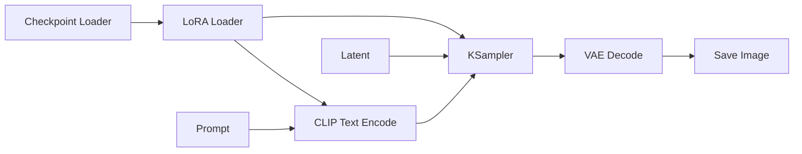
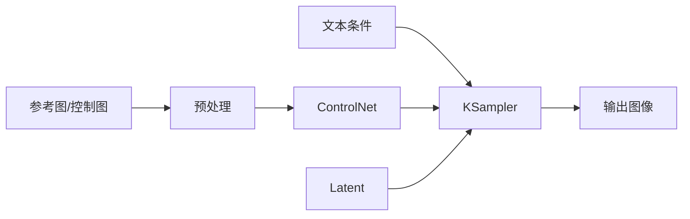
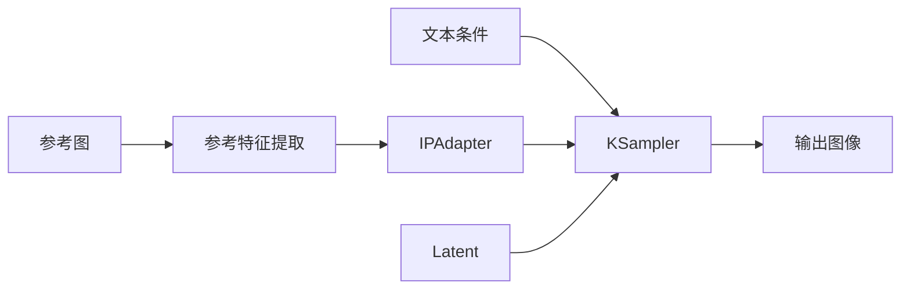

# Chapter 3：ComfyUI 第三阶段条件控制

如果说第二阶段是在学“怎么把基础工作流跑通”，那么第三阶段就是开始真正掌握：

> 如何让模型不要只靠运气出图，而是更稳定地听你的控制。

这一章的重点不是再背更多节点名，而是理解一件更重要的事：

> 生成结果为什么会被不同类型的条件共同影响。

学完本章，你应该能做到：

- 理解什么叫“条件控制”
- 区分“提示词控制”和“参考条件控制”
- 理解 `LoRA`、`ControlNet`、`IPAdapter`、`mask` 分别解决什么问题
- 能判断什么时候该控制结构，什么时候该控制风格，什么时候该控制局部区域
- 能让构图、风格、人物一致性更稳定

***

## 1. 第三阶段到底学什么

根据 README 的学习路线，第三阶段叫做“掌握条件控制”。

建议学习内容包括：

- `ControlNet`
- `IPAdapter`
- `LoRA`
- `mask` 与区域控制

这一阶段的产出标准是：

- 能解释“提示词控制”和“参考条件控制”的差异
- 能按需求让构图、风格、人物一致性更稳定

这说明第三阶段和第二阶段有一个本质区别。

第二阶段主要解决的是：

- 我能不能把流程跑起来
- 我能不能完成文生图、图生图、局部重绘、放大

第三阶段主要解决的是：

- 我能不能让结果更可控
- 我能不能让模型更稳定地遵循目标
- 我能不能把“想要什么”变成“明确的控制信号”

换句话说，第三阶段不是增加“流程类型”，而是增强“流程控制力”。

***

## 2. 什么叫条件控制

在 README 里，条件系统被概括为：

- 文本条件
- 图像条件
- 掩码条件
- 结构条件
- 参考图条件
- 风格条件

这几类条件的共同点是：

> 它们都会影响采样方向。

所以你可以把“条件控制”理解成：

> 在采样之前或采样过程中，给模型提供额外约束，让结果朝更明确的方向收敛。

如果没有条件控制，模型更多只能依赖：

- 基础模型本身
- 提示词
- 随机种子
- 采样参数

这样能出图，但不够稳定。

尤其当你开始追求下面这些目标时，单靠 prompt 往往不够：

- 固定人物姿态
- 固定构图布局
- 保留输入图的大致结构
- 让风格更像某张参考图
- 让同一个人物在多张图里尽量一致
- 只修改图像的一小块区域

这时就要进入条件控制。

***

## 3. 提示词控制和参考条件控制的区别

第三阶段最重要的第一件事，就是把这两类控制分清楚。

| 控制类型 | 主要输入 | 更擅长控制什么 | 典型问题 |
| --- | --- | --- | --- |
| 提示词控制 | 文本 | 语义、主题、风格描述 | 结果容易漂移，不够稳定 |
| 参考条件控制 | 图像、结构图、mask、参考特征 | 构图、姿态、局部范围、风格参照、一致性 | 组合复杂，容易互相打架 |

### 3.1 提示词控制是什么

提示词控制本质上是在说：

- 我想生成什么内容
- 我希望画面具有什么风格
- 我不希望出现什么元素

例如：

- 一位穿黑色风衣的女性站在雨夜街头
- 电影感灯光
- 霓虹反射
- 不要模糊，不要低质量，不要畸形手

它对“语义方向”很有用，但对下面这些事情往往不够稳定：

- 精确姿势
- 精确构图
- 人脸一致性
- 对输入参考图的忠实程度

### 3.2 参考条件控制是什么

参考条件控制是在提示词之外，再给模型更具体的约束。

这些约束可能来自：

- 一张姿态图
- 一张深度图
- 一张边缘图
- 一张人物参考图
- 一张风格参考图
- 一个局部遮罩区域

它更像是在告诉模型：

> 不只是“画什么”，还要“按什么依据来画”。

### 3.3 为什么两者要联合使用

实际工作流里，这两类控制通常不是二选一，而是联合使用。

因为：

- 提示词负责给语义方向
- 参考条件负责给约束边界

你可以把它们理解成：

```text
提示词：告诉模型“你要画什么”
参考条件：告诉模型“你要尽量按照什么来画”
```

只有当这两者配合得当，结果才会既有内容表达能力，又有稳定控制能力。

***

## 4. 第三阶段最核心的四种控制手段

README 在第三阶段明确点了四个关键词：

- `LoRA`
- `ControlNet`
- `IPAdapter`
- `mask` 与区域控制

它们分别偏向不同层面的控制。

| 控制手段 | 更偏向控制什么 | 最适合解决的问题 |
| --- | --- | --- |
| `LoRA` | 风格、角色、特定概念适配 | 让基础模型更会画某类东西 |
| `ControlNet` | 结构、姿态、空间布局 | 让构图和几何关系更稳定 |
| `IPAdapter` | 参考图特征、风格、人物一致性 | 让图像更“参考某张图” |
| `mask` / 区域控制 | 修改范围 | 只改局部，不动全局 |

你会发现，这四类工具并不冲突。

它们回答的是不同问题：

- `LoRA` 回答“模型该往哪个概念空间偏”
- `ControlNet` 回答“结构该长什么样”
- `IPAdapter` 回答“参考图影响该有多强”
- `mask` 回答“到底改哪里，不改哪里”

第三阶段真正的能力，不是单独会用其中一个，而是知道：

> 当目标变具体时，应该组合哪些控制手段。

***

## 5. LoRA：让模型更会画某种风格、角色或概念

### 5.1 LoRA 在解决什么问题

基础 checkpoint 很强，但它不可能对所有风格、人物、角色、服装、画法都足够擅长。

这时候就会引入 `LoRA`。

你可以把它理解成：

> 对基础模型进行轻量偏置，让它更容易生成某种特定概念。

它常见的用途包括：

- 特定画风
- 特定角色
- 特定服装或题材
- 特定摄影风格
- 特定表情或脸型倾向

### 5.2 LoRA 不等于结构控制

新手最容易混淆的一点是：

`LoRA` 很适合控制“像什么”，但不擅长精准控制“摆成什么姿势”。

也就是说，它更偏：

- 风格
- 角色特征
- 视觉倾向

而不偏：

- 骨架姿态
- 精确布局
- 空间深度关系

这些更像 `ControlNet` 的工作。

### 5.3 LoRA 通常插在工作流的哪里

从逻辑上看，`LoRA` 通常作用在模型资源层。

也就是：

- 先加载基础 checkpoint
- 再让 LoRA 对模型或文本编码相关部分产生影响
- 然后再进入后续编码与采样

可以粗略理解成：



不同节点包的具体名字可能不一样，但逻辑大体是这一层。

### 5.4 什么时候该优先考虑 LoRA

如果你的问题更像下面这些，通常先想到 `LoRA`：

- 为什么这个模型总画不出我想要的角色感
- 为什么某种画风总是不稳定
- 为什么某类服装、脸型、题材总是跑偏
- 为什么 prompt 写很长，结果还是不够像某个概念

### 5.5 LoRA 的常见误区

#### 误区 1：把 LoRA 当成万能控制器

`LoRA` 不能代替所有控制。

它不能天然解决：

- 精确姿态
- 精确构图
- 局部区域修改
- 严格参考图一致性

#### 误区 2：叠太多 LoRA

叠得越多，不一定越好。

多个 LoRA 同时叠加时，常见问题是：

- 风格打架
- 角色特征污染
- 画面过度强化
- 提示词难以生效

#### 误区 3：不知道 LoRA 影响的是“模型倾向”

如果你没有理解这一点，就会错误期待它能像结构控制那样精准。

其实它更像是在改变“模型更容易往哪里画”。

***

## 6. ControlNet：让结构、姿态和构图更稳定

### 6.1 ControlNet 在解决什么问题

README 对 `ControlNet` 的定位很明确：

- 通过结构条件控制构图
- 常见条件包括边缘、深度、姿态、法线、语义图

这说明 `ControlNet` 的核心价值是：

> 给模型一个更明确的结构参考，让图像遵循特定几何或空间信息。

它特别适合控制：

- 人物姿势
- 物体摆放
- 画面轮廓
- 景深与空间层次
- 大致构图关系

### 6.2 你可以把 ControlNet 想成什么

你可以把它理解成一种“结构护栏”。

prompt 告诉模型“生成什么”。

而 `ControlNet` 告诉模型：

> 结构不要跑太远，请尽量沿着这张控制图来。

### 6.3 ControlNet 的常见输入类型

README 里提到的典型结构条件包括：

- 边缘
- 深度
- 姿态
- 法线
- 语义图

这些条件分别适合不同目标。

| 条件类型 | 更适合控制什么 |
| --- | --- |
| 边缘 | 轮廓、外形、构图边界 |
| 深度 | 近大远小、空间层次 |
| 姿态 | 人体或动作骨架 |
| 法线 | 表面朝向、立体关系 |
| 语义图 | 区域类别和整体布局 |

### 6.4 ControlNet 的基本逻辑链

你不一定要死记节点名，但一定要理解链路。



这条链路最关键的是：

- 参考图先被转换成可用的控制表示
- 控制表示再参与采样
- 最终影响结果的结构稳定性

### 6.5 什么时候应该优先用 ControlNet

如果你的目标是：

- 让人物按照指定姿势站立
- 让构图尽量贴近一张草图
- 保持建筑、场景、大轮廓稳定
- 让动作和布局不要漂移

那么 `ControlNet` 往往比单纯加 prompt 更直接。

### 6.6 ControlNet 的常见误区

#### 误区 1：把它当成风格控制器

`ControlNet` 更偏结构，不是主要拿来控风格的。

如果你想要的是：

- 参考图的画风
- 参考图的脸感
- 参考图的人物一致性

很多时候更接近 `IPAdapter` 的用途。

#### 误区 2：控制图质量太差

如果输入的边缘图、姿态图、深度图本身就有问题，最终结果也会跟着偏。

所以控制质量的一部分，不在 sampler，而在前处理质量。

#### 误区 3：以为 ControlNet 越强越好

控制过强时，常见结果是：

- 画面僵硬
- 细节不自然
- prompt 的自由度下降

你要的不是“死贴参考”，而是“在稳定和自由之间找到平衡”。

***

## 7. IPAdapter：让参考图真正参与结果生成

### 7.1 IPAdapter 在解决什么问题

README 把 `IPAdapter / 参考图风格迁移` 概括为：

> 强调“参考图影响”和“文本提示影响”的联合控制。

这句话很关键。

说明 `IPAdapter` 的核心不是替代 prompt，而是把“图像参考”变成一类真正参与采样的条件。

它常见的用途包括：

- 参考图风格迁移
- 人物一致性增强
- 气质、配色、氛围借鉴
- 让生成结果更接近某张参考图的视觉感觉

### 7.2 IPAdapter 和 ControlNet 的区别

这是第三阶段最容易混淆的一组概念。

| 模块 | 更偏向什么 |
| --- | --- |
| `ControlNet` | 结构、姿态、空间布局 |
| `IPAdapter` | 图像参考特征、风格、人物相似感 |

简单记：

- 要控“形”，优先想到 `ControlNet`
- 要控“像”，优先想到 `IPAdapter`

当然真实工作流里，二者经常一起用。

### 7.3 IPAdapter 的逻辑链

可以粗略理解成：



本质上就是：

- 参考图不是简单“拿来看看”
- 它会被转换成可参与生成的条件特征

### 7.4 什么时候优先考虑 IPAdapter

如果你要解决的问题是：

- 想让新图更像某张参考图的整体气质
- 想借一张图的色彩和风格
- 想提高同一人物跨图一致性
- 想做参考图驱动而不是纯 prompt 驱动

那么 `IPAdapter` 往往更合适。

### 7.5 IPAdapter 的常见误区

#### 误区 1：以为它能精准锁死结构

如果你希望：

- 手一定摆在某个位置
- 身体必须是某个姿态
- 镜头布局必须严格一致

那通常还是 `ControlNet` 更靠谱。

#### 误区 2：把“风格参考”和“人物身份一致”混为一谈

有时你只是想借画风。

有时你是想让人脸、角色感觉接近某张图。

这两者都可能用到 `IPAdapter`，但目标不一样，控制方式也不该混着理解。

#### 误区 3：参考图过强导致 prompt 失效

如果参考图约束过强，常见现象是：

- prompt 描述不容易被采纳
- 输出总往参考图靠
- 新内容不容易加入

所以第三阶段一定要学会平衡：

- 文本条件强度
- 参考图条件强度

***

## 8. mask 与区域控制：只改该改的部分

### 8.1 为什么区域控制很重要

第二阶段你已经接触过 `inpaint`。

第三阶段要进一步理解的是：

> 局部修改不是一类孤立工作流，而是一种非常重要的控制思想。

很多真实需求都不是“整张图重画”，而是：

- 只改脸
- 只换衣服
- 只修手
- 只换背景的一部分
- 只加强某个区域的细节

这时最关键的问题不是“怎么生成”，而是：

> 到底改哪里，哪里不要动。

### 8.2 mask 控制的本质

`mask` 本质上是在定义一个生效范围。

它告诉系统：

- 白的地方改
- 黑的地方不改

或者从逻辑上说：

- 哪些区域允许重采样
- 哪些区域尽量保留原结果

### 8.3 区域控制通常和哪些东西一起用

区域控制很少单独存在。

它经常和下面这些一起配合：

- `img2img`
- `inpaint`
- `LoRA`
- `ControlNet`
- `IPAdapter`

你可以把它理解成一层“范围约束”。

例如：

- 用 `IPAdapter` 控参考风格
- 但只让这种影响发生在人物区域

或者：

- 用 `ControlNet` 控姿态
- 但只重绘角色，不动背景

### 8.4 第三阶段为什么必须学 mask

因为一旦没有范围控制，你会经常遇到：

- 想修脸，结果背景也变了
- 想改衣服，结果姿势也跑了
- 想补局部细节，结果整体风格被洗掉

`mask` 的价值就在于：

> 把控制作用缩小到真正需要的地方。

***

## 9. 第三阶段最重要的能力：会组合条件

真正的工作流很少只靠一个控制器。

更常见的情况是多种条件联合工作。

### 9.1 最常见的几种组合

#### 组合 1：提示词 + LoRA

适合：

- 想强化特定画风
- 想稳定特定角色倾向
- 想让某类概念更容易被模型画出来

#### 组合 2：提示词 + ControlNet

适合：

- 想明确构图
- 想固定姿态
- 想让布局更稳定

#### 组合 3：提示词 + IPAdapter

适合：

- 想参考某张图的视觉风格
- 想让人物一致性更高
- 想让结果更像某个参考来源

#### 组合 4：提示词 + ControlNet + IPAdapter

适合：

- 既要结构稳定
- 又要风格或参考感稳定

这类流程在真实使用里非常常见。

#### 组合 5：以上任意组合 + mask

适合：

- 只想让控制作用于局部区域
- 避免整图被一起带偏

### 9.2 组合时最常见的冲突

当你开始叠控制条件时，最容易出现的不是“没效果”，而是“条件打架”。

典型冲突包括：

- prompt 说要一个姿态，ControlNet 给了另一个姿态
- LoRA 说要强风格化，IPAdapter 给了另一种视觉参考
- mask 范围太大，导致不该改的区域也被重采样
- 控制条件太多，结果整体僵硬

所以第三阶段的关键不是“越多越强”，而是：

> 先明确目标，再决定由哪类条件负责哪一部分控制。

### 9.3 一个实用的分工思路

你可以用下面这个脑图来分工：

```text
要表达什么内容 -> prompt
要偏哪种概念或角色 -> LoRA
要遵循什么结构 -> ControlNet
要参考哪张图的感觉 -> IPAdapter
要限制影响范围 -> mask
```

只要分工清楚，工作流就不会太乱。

***

## 10. 四类典型目标，应该怎么选控制方式

### 10.1 想让人物姿势稳定

优先考虑：

- `ControlNet`
- 必要时配合 `mask`

原因是这是结构问题，不是单纯风格问题。

### 10.2 想让人物或角色更像某种设定

优先考虑：

- `LoRA`
- 必要时配合 `IPAdapter`

原因是这是概念与参考一致性问题。

### 10.3 想让结果更像某张参考图的气质

优先考虑：

- `IPAdapter`
- 再用 prompt 约束具体内容

### 10.4 想只修局部，不影响整体

优先考虑：

- `mask`
- 配合 `inpaint`
- 视需求叠加 `LoRA`、`ControlNet` 或 `IPAdapter`

***

## 11. 第三阶段的调试思路

很多人到了这一阶段，会有一个明显感受：

> 为什么我条件加得越多，结果反而越乱？

这通常不是模型太差，而是没有按正确方式调试。

建议你按下面的顺序排查。

### 11.1 先只保留主控制目标

不要一开始就：

- 开 `LoRA`
- 开 `ControlNet`
- 开 `IPAdapter`
- 再加一堆局部 mask

正确做法是先问：

> 这次最核心要控制的到底是什么？

只保留主控制器，先看单独效果。

### 11.2 再逐步叠加次要条件

如果主目标已经成立，再叠第二层控制。

比如：

1. 先用 `ControlNet` 把姿态锁住
2. 再加 `IPAdapter` 做风格参考
3. 最后再用 `mask` 限定局部修改

这样你才能知道到底是哪一层出了问题。

### 11.3 出现冲突时，先判断谁越权了

例如：

- 构图乱了，说明结构控制不够或者被别的条件冲掉了
- 风格跑了，说明参考控制不够或者 LoRA 方向不对
- 局部改坏了整图，说明范围控制有问题

不要只会盲目改步数和 seed。

很多时候真正的问题不是采样参数，而是控制分工错误。

***

## 12. 第三阶段最容易犯的错误

### 12.1 只会加条件，不会删条件

成熟的工作流设计能力，往往体现在：

- 知道什么该加
- 更知道什么不该加

### 12.2 把所有问题都归因于 prompt

到第三阶段以后，很多问题已经不是 prompt engineering 能单独解决的。

例如：

- 姿态不稳
- 人物不一致
- 构图总漂
- 局部修补总牵连全图

这些都更像条件控制问题。

### 12.3 不理解“结构控制”和“风格控制”是两回事

这是最关键的思维分水岭。

如果这点不清楚，你会一直分不清：

- 为什么 `ControlNet` 控不住风格
- 为什么 `IPAdapter` 锁不住姿态
- 为什么 `LoRA` 提高了角色感，却没有提高构图稳定性

### 12.4 忽视区域控制

很多人学会了 `LoRA`、`ControlNet`、`IPAdapter`，却仍然经常把整张图改坏。

原因很简单：

他们没有把 `mask` 当成一个核心控制器来理解。

其实在真实修图和精修流程里，区域控制几乎是必修项。

***

## 13. 建议练习

第三阶段一定要做练习，而且要带着“控制目标”去练。

### 练习 1：只用 prompt 和 LoRA

要求：

- 选一个基础模型
- 加一个风格或角色类 `LoRA`
- 用同一组 prompt 对比开关 `LoRA` 的区别

你要观察的是：

- 角色感是否更稳定
- 风格是否更集中
- 画面是否被过度带偏

### 练习 2：做一次简单姿态控制

要求：

- 使用一张姿态参考
- 用 `ControlNet` 驱动生成
- prompt 只负责描述内容和风格

你要观察的是：

- 姿态是否明显更稳定
- prompt 是否还能自由发挥
- 控制过强时画面会不会变僵

### 练习 3：做一次参考图风格迁移

要求：

- 选一张风格明确的参考图
- 使用 `IPAdapter`
- 同时保留文本 prompt

你要观察的是：

- 风格借鉴是否明显
- 参考图影响和 prompt 影响谁更强
- 结果是在“参考”还是在“照抄”

### 练习 4：做一次局部精修

要求：

- 选一张已有图像
- 只修一个很小的区域
- 使用 `mask` 限定范围

你要观察的是：

- 目标区域是否被有效修改
- 非目标区域是否保持稳定
- mask 边界是否自然

### 练习 5：写出四种控制器的职责分工

请你用文字写清楚：

- `LoRA` 更适合控制什么
- `ControlNet` 更适合控制什么
- `IPAdapter` 更适合控制什么
- `mask` 更适合控制什么

如果这一步写不出来，说明第三阶段还没有真正吃透。

***

## 14. 第三阶段完成标准

如果你已经能做到下面这些，就说明第三阶段基本达标：

- 能解释“提示词控制”和“参考条件控制”的差异
- 能区分结构控制、风格控制、参考图控制、区域控制
- 能判断什么时候该用 `LoRA`
- 能判断什么时候该用 `ControlNet`
- 能判断什么时候该用 `IPAdapter`
- 能理解 `mask` 为什么是局部精修的关键
- 能把多种条件按目标进行组合，而不是盲目堆叠

如果还做不到，不建议急着进入第四阶段。

因为第四阶段会开始强调：

- 缓存
- 增量执行
- 显存压力
- 大图和复杂工作流优化

而如果你第三阶段没有掌握清楚，第四阶段你只会觉得：

- 图越来越复杂
- 显存越来越吃紧
- 结果却不一定更稳定

***

## 15. 本章总结

第三阶段的本质，是从“会跑工作流”进入“会控制工作流”。

请记住下面五句话：

1. prompt 负责描述“想生成什么”
2. `LoRA` 负责强化某种概念、角色或风格倾向
3. `ControlNet` 负责稳定结构、姿态和构图
4. `IPAdapter` 负责把参考图影响真正引入生成过程
5. `mask` 负责限定哪些地方改，哪些地方不改

如果把它们组合成一句更完整的话，就是：

```text
用 prompt 定义内容，
用 LoRA 调整模型倾向，
用 ControlNet 稳住结构，
用 IPAdapter 引入参考图，
再用 mask 把影响限制在正确区域。
```

当你真正掌握这套分工后，你就不再只是“会连节点”，而是开始具备了工作流设计能力。

下一步进入第四阶段时，你要开始思考的问题就会变成：

- 为什么某些节点会重复算
- 为什么某些流程特别吃显存
- 为什么大图和多条件会明显拖慢速度
- 怎样设计更稳定、更省资源的工作流

这也正是第四阶段要进入的主题：执行与优化。
