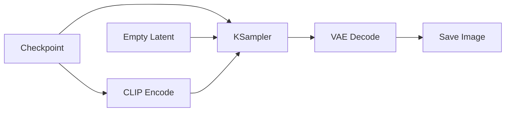

# Chapter 4：ComfyUI 第四阶段执行与优化

如果说第三阶段是在学“怎么控制结果”，那么第四阶段就是开始理解：

> 为什么同样一张图，有的工作流跑得很快，有的工作流却又慢又吃显存。

这一章的重点，不再是“多加一个什么节点”，而是开始建立工程视角。

你要真正理解的是：

- 工作流为什么会执行
- 哪些部分会被重复计算
- 为什么有些修改只会重算局部
- 为什么有些参数改动会引发整条链重新跑
- 为什么有些图一复杂就会明显拖慢速度

学完本章，你应该能做到：

- 理解 `脏节点`、`增量执行`、`缓存`、`部分图执行` 的基本逻辑
- 能解释为什么 ComfyUI 不需要每次都整图重跑
- 能判断哪些节点最可能成为速度或显存瓶颈
- 能理解 `latent` 尺寸、模型切换、多条件叠加和速度之间的关系
- 能设计更稳定、更省资源的大图工作流

***

## 1. 第四阶段到底学什么

根据 README 的学习路线，第四阶段叫做“理解执行与优化”。

建议学习内容包括：

- 为什么只重算部分节点
- 哪些节点最吃显存
- `latent` 尺寸与速度的关系
- 模型切换与缓存复用

这一阶段的产出标准是：

- 能定位慢点
- 能压缩无效计算
- 能设计更稳定的大图工作流

这说明第四阶段和前几阶段的重点完全不同。

前面几章你主要在学：

- 工作流是什么
- 基础流程怎么搭
- 条件怎么控制

第四阶段你开始真正接触：

- 执行器如何看待这张图
- 资源是怎么被加载和复用的
- 显存为什么会紧张
- 为什么某些工作流“看起来差不多”，运行成本却差很多

换句话说，第四阶段是在从“会搭工作流”转向“会设计高效工作流”。

***

## 2. 为什么第四阶段很重要

很多人学 ComfyUI 会卡在一个瓶颈：

- 基础图会搭
- 条件控制也会加
- 但一到复杂工作流就开始混乱

典型表现包括：

- 每次一改参数都要等很久
- 显存突然爆掉
- 多条件一叠就非常慢
- 看不出来到底哪个节点是瓶颈
- 不知道该删哪里、该拆哪里、该缓存哪里

这说明问题已经不再是“不会连线”，而是：

> 不理解执行机制，导致不会优化。

真正成熟的 ComfyUI 使用者，不只是能把图跑起来，而是知道：

- 哪些计算值得重复做
- 哪些计算应该尽量避免重复做
- 哪些资源该常驻
- 哪些流程应该拆成两段

这就是第四阶段的核心。

***

## 3. 先建立一个正确的执行心智模型

第四阶段最重要的第一步，是把 ComfyUI 从“画布上的节点图”切换成“执行器眼里的依赖图”。

你在前端看到的是：

- 节点
- 端口
- 连线
- 参数

执行器真正关心的是：

- 哪些节点有依赖关系
- 哪些输入已经准备好
- 哪些节点受这次改动影响
- 哪些结果可以复用
- 哪些节点根本不需要执行

所以从执行器视角看，一张工作流不是“很多小方块”，而更像这样：

```text
输入变化 -> 找出受影响节点 -> 计算必要子图 -> 复用未变化结果 -> 输出结果
```

如果没有这个心智模型，你就很容易把很多性能问题误解成：

- 显卡不够强
- 步数太高
- 模型太大

这些当然会影响速度，但很多时候更本质的问题是：

> 你的工作流让系统做了太多本来可以不做的事。

***

## 4. 拓扑依赖：工作流不是从上到下执行，而是按依赖执行

README 在“图执行引擎的核心逻辑”里首先强调的是拓扑依赖。

这意味着一个节点能不能执行，不取决于它画在画布的什么位置，而取决于：

- 它需要的输入有没有准备好
- 它依赖的上游节点是否已经完成
- 它是否仍然连在一条有效输出链上

所以 ComfyUI 的执行顺序本质上是：

> 沿依赖关系推进，而不是沿视觉排版推进。

### 4.1 为什么这个概念重要

因为很多新手会下意识以为：

- 画在左边的先执行
- 画在右边的后执行
- 画得靠上的更早执行

实际上这些都不可靠。

真正决定顺序的是依赖关系。

### 4.2 一个最简单的理解方式

你可以把它理解成：



在这条链里：

- `KSampler` 不能早于 `Checkpoint`、`CLIP Encode`、`Empty Latent`
- `VAE Decode` 不能早于 `KSampler`
- `Save Image` 不能早于 `VAE Decode`

这就是最基本的拓扑执行逻辑。

### 4.3 这和优化有什么关系

关系非常大。

因为只要你理解依赖，就能理解：

- 为什么一个上游节点改动会影响很多下游节点
- 为什么一个末端保存节点的变化不会反过来影响上游采样
- 为什么拆分支路有时能减少无关计算

所以优化的第一步，从来不是先调参数，而是先看依赖结构。

***

## 5. 脏节点与增量执行：为什么 ComfyUI 不用每次整图重算

README 对这一点的总结很关键：

> ComfyUI 的一个重要优化是：只重算发生变化的部分。

这就是第四阶段最必须吃透的概念。

### 5.1 什么是脏节点

所谓“脏节点”，你可以先把它理解成：

> 这次执行里，它的输入、参数或上游依赖发生了变化，所以旧结果已经不可信了。

一旦一个节点变脏，它通常会带来一个连锁反应：

- 它自己需要重算
- 依赖它输出的下游节点也会变脏

### 5.2 什么是增量执行

增量执行就是：

> 只重新执行脏节点和受影响的下游节点，未变化的部分直接复用。

这和很多人想象中的“整张图全部重新跑”完全不同。

### 5.3 一个最经典的例子

假设你有一条链：

```text
Checkpoint -> CLIP Encode -> KSampler -> VAE Decode -> Save Image
```

如果你只改了：

- 保存文件名前缀

那么理论上受影响的只是输出阶段，前面的模型加载、文本编码、采样都不该重算。

但如果你改了：

- 正向提示词

那么：

- `CLIP Encode` 变脏
- `KSampler` 变脏
- `VAE Decode` 变脏
- `Save Image` 当然也会重走

### 5.4 README 里明确提到的典型变化

当你修改这些内容时，往往会触发部分重算：

- 正向提示词
- 采样器步数
- `CFG`
- 种子

这些变化的共同点是：

> 它们会影响采样结果。

所以真正发生变化的，不只是参数数字，而是下游结果的可信性。

### 5.5 为什么这个机制工程价值很大

README 提到的意义包括：

- 减少重复编码和重复加载
- 降低显存波动
- 缩短迭代时间
- 让复杂图可交互调试

这四条非常重要。

如果没有增量执行，复杂工作流几乎很难进行高频试错。

因为你每改一个小地方，都要付出整图重算的代价。

***

## 6. 如何判断一次修改会影响到哪里

第四阶段一个非常实用的能力，就是在改参数之前，先判断：

> 这次改动会让哪一段链路变脏？

### 6.1 改提示词

通常会影响：

- 文本编码节点
- 采样节点
- 采样后的所有下游节点

### 6.2 改种子、步数、CFG、采样器

通常会直接影响：

- `KSampler`
- 下游 `VAE Decode`
- 保存输出链

但不会一定影响：

- 模型加载本身
- 输入图像读取本身

### 6.3 改输出保存方式

通常更多影响：

- 最末端输出节点

一般不会反过来污染前面的采样链。

### 6.4 改模型或切换 LoRA / ControlNet / IPAdapter

这类改动的影响通常更大。

因为它们往往会改变：

- 模型对象
- 条件结构
- 采样输入

所以重算范围通常会明显扩大。

### 6.5 为什么要学这个判断

因为一旦你能在脑中预判脏节点传播路径，你就会开始主动优化：

- 把高频修改的部分尽量放在后面
- 把高成本但稳定的部分尽量固化
- 把实验性分支和主链分开

这就是从“使用者”走向“设计者”的分水岭。

***

## 7. 缓存：为什么有些结果可以直接复用

README 提到，缓存通常出现在几个层面：

- 节点级输出缓存
- 模型对象缓存
- 前端预览缓存
- 文件级结果复用

很多人会把缓存理解得很模糊，但第四阶段一定要把它拆开看。

### 7.1 节点级输出缓存

这是最直接的一层。

意思是：

> 如果一个节点这次输入和参数都没变，它之前的输出就可能被直接复用。

例如：

- 某个文本编码结果没变
- 某个图像预处理结果没变
- 某个上游固定输入没变

那么重新执行时就不必从头再算一遍。

### 7.2 模型对象缓存

这一层通常和加载成本关系最大。

因为模型加载很重，尤其包括：

- checkpoint
- VAE
- CLIP
- LoRA 相关装配
- ControlNet 相关资源

如果每次都重新从磁盘读、重新上显存，代价会非常高。

所以模型对象缓存的价值在于：

> 尽量让已经加载过的资源能继续复用。

### 7.3 前端预览缓存

这一层更偏交互体验。

它的意义是：

- 前端不必每次都重新拉取和渲染同样的预览
- 用户能更快看到状态和历史

虽然它不一定直接加速核心推理，但会影响你“感觉系统是不是顺畅”。

### 7.4 文件级结果复用

这是更广义的缓存思路。

例如：

- 某些中间图先保存下来
- 某些阶段产物拆成独立流程复用
- 某些大图任务分段执行后复用前一段结果

这类做法在复杂工程流里非常常见。

### 7.5 缓存命中意味着什么

README 说得很直接：

> 缓存命中时，执行器可以跳过某些节点，直接复用已有中间结果。

这句话翻译成更实用的话就是：

> 你省下来的不只是时间，还省下了重复占用显存和重复触发不必要计算。

***

## 8. 部分图执行：不是所有画布上的节点都会跑

README 还强调了一个容易被忽略的点：

> ComfyUI 只会执行“能够通向有效输出”的部分图。

这叫部分图执行。

### 8.1 这意味着什么

意味着在同一张大图里：

- 没连到输出的节点可能不会执行
- 断开的实验支路可能不会浪费算力
- 你可以在一张图里保留多个试验片段

### 8.2 为什么这个机制很有用

因为你不必为了保留实验思路而每次都复制一整份工作流。

你可以：

- 保留旧分支做对比
- 临时断开某段链路
- 在同一张图上做多个方案试验

只要它们没有进入有效输出路径，就不一定会成为本次成本。

### 8.3 但不要误解成“随便堆图都没事”

部分图执行虽然能避免无效计算，但并不意味着你可以无限制堆杂乱节点。

因为过于复杂的画布仍然会带来：

- 可读性下降
- 调试成本上升
- 误连线风险增加
- 维护困难

所以部分图执行是优化机制，不是鼓励混乱设计的理由。

***

## 9. 哪些节点最可能成为性能瓶颈

README 在第四阶段要求你理解：

- 哪些节点最吃显存

这件事必须重点讲。

### 9.1 采样节点通常是核心瓶颈

在大多数图像工作流里，`KSampler` 一类采样节点通常是最重的。

因为它承担：

- 多轮去噪迭代
- 对潜空间数据反复计算
- 模型前向推理

所以当你看到整条链很慢时，第一反应往往应该先看采样段。

### 9.2 模型加载节点是另一类高成本节点

模型加载不一定每次都最耗时，但它有时会带来明显卡顿，尤其在：

- 首次加载
- 切换 checkpoint
- 切换大型 ControlNet
- 多模型轮换

这类成本有时不是“算得慢”，而是“加载和搬运很重”。

### 9.3 VAE 编解码也可能成为瓶颈

尤其在高分辨率下：

- `VAE Encode`
- `VAE Decode`

都可能带来明显开销。

新手容易只盯采样器，却忽略了高分辨率图像进出潜空间本身也要花成本。

### 9.4 图像预处理和多条件模块也会累积成本

当你加入：

- 多个 `ControlNet`
- 多个参考图
- 多个预处理器
- 多路局部分支

每个单点可能没有采样器那么重，但叠起来就很可观。

### 9.5 为什么“最吃显存”和“最耗时”不一定是同一个点

这一点必须分清。

有些节点：

- 显存占用高
- 但执行时间不一定最长

有些节点：

- 占用不是最高
- 但因为执行次数多，累计时间长

所以优化时不要只问一个问题，而要同时问：

- 谁最占显存
- 谁最耗时间

***

## 10. latent 尺寸为什么会直接影响速度和显存

README 在第四阶段明确要求理解：

- `latent` 尺寸与速度的关系

这其实是 ComfyUI 性能认知里非常核心的一块。

### 10.1 什么是 latent 尺寸

你可以先简单理解成：

> 模型真正进行扩散计算的数据尺寸。

最终输出的是像素图，但很多核心计算并不是直接在像素空间里做，而是在潜空间里做。

### 10.2 为什么尺寸一变，成本就明显变化

因为只要分辨率更高，就意味着：

- 潜空间张量更大
- 每一步采样都要处理更多数据
- 中间结果占用更多显存
- 编解码阶段也更重

所以分辨率从小图到大图，不是“线性增加一点点成本”，而常常会带来非常明显的压力变化。

### 10.3 这和第二阶段学的宽高有什么联系

第二阶段你已经知道：

- `width`
- `height`

决定基础输出尺寸。

第四阶段你要进一步理解：

> 它们不只是构图参数，也是性能参数。

改宽高，不是在改“显示大小”，而是在改整条采样链的数据规模。

### 10.4 大图为什么更容易出问题

因为大图会同时放大几个压力点：

- 采样计算量
- VAE 编解码压力
- 多条件叠加成本
- 显存波动

这也是为什么很多成熟流程不是一上来就高分辨率直出，而是会考虑：

- 先低分辨率生成
- 再局部修正
- 再放大与细化

这其实就是一种典型的成本控制思路。

***

## 11. 模型切换与缓存复用：为什么频繁换模型会拖慢流程

README 在第四阶段点了：

- 模型切换与缓存复用

这说明优化不只是看采样参数，还要看资源调度。

### 11.1 为什么模型切换昂贵

因为模型切换往往不是一个简单的变量赋值，而可能涉及：

- 从磁盘加载权重
- 把模型放进内存或显存
- 旧模型迁移、卸载或替换
- 重新建立相关对象引用

这些操作的成本，有时会比你想象得更高。

### 11.2 为什么频繁切换会破坏流畅性

如果你的工作流反复在多个大模型之间来回切换，就容易出现：

- 首次等待时间长
- 显存腾挪频繁
- 缓存命中下降
- 总吞吐变差

换句话说：

> 不是只有“模型大”才慢，模型切换频繁也会慢。

### 11.3 优化思路是什么

很核心的一条思路是：

> 尽量让一段连续任务复用同一批资源。

例如：

- 同类任务尽量批量跑
- 相同 checkpoint 的实验集中做
- 不必要的模型来回切换尽量减少

这会显著提高缓存复用率。

***

## 12. 多条件、多分支、大图，为什么会一起把成本推高

README 在性能章节里提到的资源压力来源包括：

- 大模型权重加载
- 高分辨率 latent
- 批量采样
- 多 `ControlNet` / 多条件并发

这几件事之所以危险，不是因为它们单独存在，而是它们经常叠加。

### 12.1 一个典型的高压场景

例如你做一张大图，同时：

- 使用高分辨率
- 叠两个 `ControlNet`
- 再加一个 `IPAdapter`
- 再开局部修复分支

这时你面对的不是单一成本，而是多个压力点共同存在：

- 采样重
- 条件重
- 编解码重
- 显存紧

### 12.2 为什么这类图最难调

因为它的慢，不一定只来自一个地方。

可能是：

- 分辨率太高
- 条件太多
- 某个预处理太重
- 某段分支重复编码
- 模型切换太频繁

如果你没有第四阶段的分析能力，就会很容易：

- 盲目降步数
- 盲目删 prompt
- 盲目怀疑显卡

但真正应该做的是拆解成本来源。

***

## 13. 性能思维：优化不是玄学，而是减少无效成本

README 的“性能思维”部分给了四条非常关键的方向：

- 减少无效节点
- 控制数据尺寸
- 避免重复编码
- 合理拆分工作流
- 明确哪个节点是瓶颈

这一段其实就是第四阶段的总纲。

### 13.1 减少无效节点

无效节点不一定会执行，但它们常常让图更难维护。

更重要的是，真正接入主链的冗余节点会直接制造额外成本。

所以优化第一步通常不是“加速器”，而是先问：

> 这个节点真的有必要存在吗？

### 13.2 控制数据尺寸

这包括：

- 生成分辨率
- batch size
- 视频帧规模
- 多图并行规模

数据尺寸一旦失控，后面的优化空间会急剧缩小。

### 13.3 避免重复编码

README 明确提到减少重复编码。

这很重要，因为很多人设计工作流时会不知不觉：

- 对同一输入多次做相似预处理
- 对同一图像多次反复编码
- 在多个分支里重复做相同准备工作

如果这些结果本来可以共享，却没有共享，就会白白浪费算力。

### 13.4 合理拆分工作流

并不是所有事情都必须在一张超级大图里一次完成。

很多更成熟的做法是：

- 先跑基础生成
- 再跑局部修正
- 再跑放大和细化

这种拆分的价值在于：

- 每一段更容易调试
- 每一段更容易复用结果
- 每一段更容易定位瓶颈

### 13.5 明确哪个节点是瓶颈

这条最关键。

如果你不知道谁是瓶颈，就无法做有效优化。

工程上最怕的不是慢，而是：

> 不知道为什么慢。

***

## 14. 一个实用的优化分析框架

当你面对一个又大又慢的工作流时，可以按下面顺序分析。

### 14.1 先问：慢在加载，还是慢在执行

如果首次特别慢、换模型特别卡，优先怀疑：

- 模型加载
- 模型切换
- 缓存没命中

如果每次都慢，优先怀疑：

- 采样太重
- 分辨率太高
- 条件过多

### 14.2 再问：是整图都慢，还是某段特别慢

如果是整图都慢，通常是全局规模问题。

如果只是某一段明显拖后腿，往往是局部瓶颈问题。

### 14.3 再问：是算了太多，还是算了太大

这是第四阶段非常重要的区分。

- “算了太多”常指重复计算、无效分支、冗余条件
- “算了太大”常指高分辨率、大 batch、大模型

很多优化失败，就是因为把这两类问题混为一谈。

### 14.4 最后问：能不能拆阶段复用

如果某一段很稳定，不需要频繁改动，就可以考虑：

- 独立成阶段
- 固化结果
- 减少后续重复执行

这比一直在同一条大图里反复全链调试高效得多。

***

## 15. 第四阶段最容易犯的错误

### 15.1 把所有慢都归因于显卡不够强

硬件当然重要，但很多工作流慢并不是因为设备绝对不行，而是因为设计不合理。

例如：

- 无谓的大分辨率
- 不必要的多条件叠加
- 重复编码
- 频繁模型切换

这些都属于“工作流设计问题”。

### 15.2 只会降步数，不会分析瓶颈

步数降低确实可能提速，但它不是万能优化手段。

如果真正的问题在于：

- 分辨率过高
- 模型切换频繁
- 编解码重复

那你只降步数，收益可能很有限。

### 15.3 把所有节点都堆在一张图里

这会带来：

- 调试困难
- 维护困难
- 瓶颈不清
- 复用率低

复杂工作流不等于成熟工作流。

### 15.4 不理解“能复用”和“必须重算”的边界

第四阶段的核心就是学会分辨：

- 哪些结果是稳定资产
- 哪些结果是一改就会污染下游的动态部分

如果这条边界感没有建立起来，你就很难做出真正高效的流程。

***

## 16. 建议练习

第四阶段一定要用“对比实验”的方式学习。

### 练习 1：观察不同改动的重算范围

要求：

- 准备一条基础工作流
- 分别只改 prompt、只改 seed、只改输出保存设置
- 观察你预期中哪些节点应该受影响

你要训练的是：

- 脏节点传播判断能力

### 练习 2：对比小图和大图速度差异

要求：

- 使用同一模型、同一 prompt、同一采样设置
- 只修改分辨率

你要观察的是：

- 时间差异
- 显存压力变化
- 结果细节和成本是否匹配

### 练习 3：对比单条件和多条件工作流

要求：

- 先跑一个基础流程
- 再逐步叠加 `ControlNet`、`IPAdapter` 或其他条件

你要观察的是：

- 速度如何变化
- 哪一步开始明显变慢
- 哪些控制收益值得保留

### 练习 4：做一次工作流拆分

要求：

- 把“生成 -> 局部修复 -> 放大”拆成多个阶段
- 比较和“一张大图全做完”之间的差别

你要观察的是：

- 调试效率
- 复用效率
- 出错定位难度

### 练习 5：写出一个优化判断表

请你自己总结：

- 什么情况下优先怀疑分辨率
- 什么情况下优先怀疑采样
- 什么情况下优先怀疑模型切换
- 什么情况下优先考虑拆工作流

如果这张表写不出来，说明第四阶段还没有真正消化。

***

## 17. 第四阶段完成标准

如果你已经能做到下面这些，就说明第四阶段基本达标：

- 能解释什么是拓扑依赖
- 能解释什么是脏节点和增量执行
- 能理解缓存为什么能减少重复计算
- 能理解为什么不是所有画布上的节点都会执行
- 能判断采样、模型加载、VAE 编解码、多条件模块分别可能带来的成本
- 能理解 `latent` 尺寸和分辨率为什么会直接影响速度与显存
- 能意识到模型切换会破坏缓存复用
- 能从“减少无效成本”的角度设计工作流

如果还做不到，不建议急着进入第五阶段。

因为第五阶段会开始进入：

- API 化
- 模板化
- 服务化
- 与外部系统集成

而如果第四阶段基础没打稳，你在工程化使用时会很容易遇到：

- 任务堆积
- 显存竞争
- 吞吐不稳
- 模板工作流效率低

***

## 18. 本章总结

第四阶段的本质，是从“看懂节点图”进入“看懂执行成本”。

请记住下面六句话：

1. ComfyUI 按依赖执行，不按画布位置执行
2. 一次改动不会天然导致整图重跑，真正重算的是脏节点及其下游
3. 缓存的价值，是让未变化的结果可以直接复用
4. 不是所有画布上的节点都会执行，只有通向有效输出的子图才重要
5. 分辨率、采样、多条件和模型切换，都会共同决定性能成本
6. 优化的核心不是玄学调参，而是减少无效计算和无效资源消耗

如果把这一章压缩成一句话，就是：

```text
先理解谁在执行、谁必须重算、谁可以复用，
再去谈怎么让工作流更快、更稳、更省资源。
```

当你真正掌握这一点后，你看待 ComfyUI 的方式就会发生变化。

你不再只是“把节点连起来的人”，而开始成为：

- 会分析执行路径的人
- 会设计资源复用的人
- 会控制复杂度的人

下一步进入第五阶段时，你要开始思考的问题就会变成：

- 怎么把工作流导出成 API 格式
- 怎么让外部程序提交任务
- 怎么管理输入输出目录
- 怎么把流程做成可参数化模板

这也正是第五阶段要进入的主题：工程化使用。
