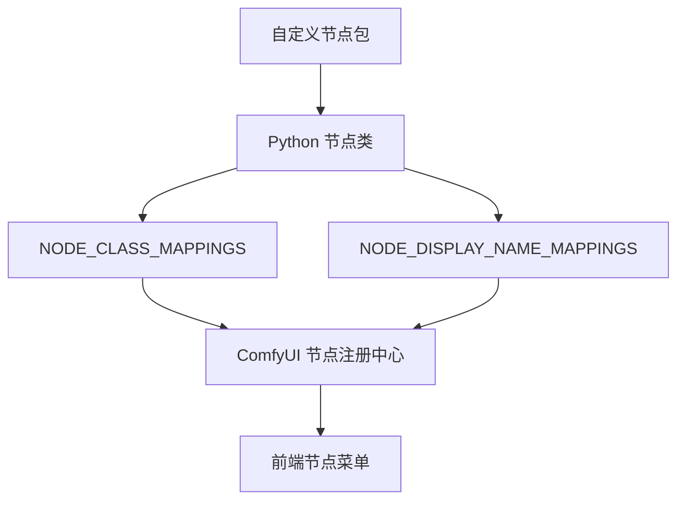

# Chapter 6：ComfyUI 第六阶段扩展开发

如果说第五阶段是在学“怎么把 ComfyUI 接进系统”，那么第六阶段就是开始真正理解：

> 怎么把你自己的能力、逻辑、算法和业务流程，变成 ComfyUI 里可复用的节点。

这一章的重点，不再是“调用现成节点”，而是：

- 自己定义节点
- 自己声明输入输出
- 自己注册到系统里
- 自己处理依赖、兼容性和维护成本

学完本章，你应该能做到：

- 理解自定义节点在 ComfyUI 生态里的位置
- 理解一个自定义节点包通常由哪些部分组成
- 能解释节点类、输入输出声明、注册映射之间的关系
- 能理解为什么输入输出设计、张量维度、显存控制、依赖管理会成为开发难点
- 能把一段业务能力封装成图中可复用组件

***

## 1. 第六阶段到底学什么

根据 README 的学习路线，第六阶段叫做“进入扩展开发”。

建议学习内容包括：

- 自定义节点结构
- Python 节点开发
- 前端扩展资源
- 版本兼容与依赖管理

这一阶段的产出标准是：

- 能开发自己的节点
- 能把业务能力封装成图中可复用组件

这说明第六阶段和前几阶段的区别非常明显。

前面几章你主要在学习：

- 如何理解节点图
- 如何搭建工作流
- 如何控制结果
- 如何优化执行
- 如何进行 API 化和工程化集成

而第六阶段开始学习：

- 如何定义新的节点能力
- 如何让新能力接入现有工作流
- 如何让前端和后端都认识这个节点
- 如何让它在升级和维护中持续可用

换句话说，第六阶段是在从“使用平台”进入“扩展平台”。

***

## 2. 为什么自定义节点是 ComfyUI 的关键扩展点

README 对这一点的定位非常直接：

> 自定义节点是 ComfyUI 生态最关键的扩展点之一。

这句话值得反复理解。

因为 ComfyUI 的强大，不只来自它已经自带了多少节点，更来自：

> 它允许你把新的能力接进这个图执行系统里。

一旦理解这一点，你就会明白为什么 ComfyUI 生态能持续扩张。

它不是一个“功能固定死”的工具，而是一个：

- 可注册新节点的系统
- 可接入新模型的系统
- 可封装新流程的系统
- 可承载业务逻辑的系统

这也是为什么很多第三方生态、管理器、工作流包会围绕它发展起来。

***

## 3. 自定义节点到底在解决什么问题

README 在“自定义节点解决什么问题”里列出了几类典型用途：

- 新模型接入
- 新采样策略
- 新图像处理算法
- 业务系统集成
- 云端 API 调用
- 视频与音频处理
- 数据处理与自动化流程

这张清单其实已经说明了一件事：

> 自定义节点不是只给“算法研究”准备的，它也非常适合工程逻辑和业务流程封装。

### 3.1 新模型接入

当一个新模型类型出现，而核心节点还不支持时，自定义节点就可以承担：

- 模型加载
- 参数适配
- 推理调用
- 输出格式对齐

### 3.2 新算法或新算子接入

如果你有新的：

- 图像处理算法
- 采样方法
- 后处理逻辑
- 特征提取方法

你可以把它们变成工作流里的一个节点，而不是只能在图外单独写脚本调用。

### 3.3 业务系统集成

这是很多人会低估的一类用途。

你完全可以把下面这些事情做成节点：

- 调企业内部接口
- 调第三方云 API
- 读写数据库或对象存储
- 做审核、打标、回传、记录

这类节点的重点未必在“生成算法”，而在“系统衔接”。

### 3.4 数据处理与自动化流程

当你的工作流不只是“出图”，而是：

- 读数据
- 转格式
- 批处理
- 触发下游动作

这时自定义节点就会非常有价值。

因为它可以把原本散落在图外的逻辑拉回图内，让整条流程更完整。

***

## 4. 一个自定义节点包通常由什么组成

README 对“自定义节点的基本构成”给出的清单是：

- Python 包入口
- 节点类定义
- 输入输出声明
- 节点注册映射
- 可选的前端资源
- 可选的依赖安装文件

这六部分就是第六阶段最需要建立的结构感。

### 4.1 Python 包入口

这部分可以理解成节点包被系统发现和加载的入口。

它承担的是：

- 组织模块
- 暴露注册信息
- 让 ComfyUI 知道这个包里有哪些节点

### 4.2 节点类定义

这是功能主体。

也就是：

- 具体做什么事
- 接收什么输入
- 产出什么输出
- 运行时执行什么逻辑

如果把节点包比作一个应用模块，节点类就是其中的核心功能单元。

### 4.3 输入输出声明

这是很多初学者最容易轻视，但实际最关键的部分之一。

因为节点不是孤立运行的，它必须接在工作流里。

所以你必须说清楚：

- 这个节点需要什么
- 这个节点输出什么
- 上下游怎样连

这本质上是在定义节点的接口协议。

### 4.4 节点注册映射

这是让系统真正“认识你这个节点”的关键桥梁。

如果没有注册映射，哪怕你写好了类，ComfyUI 也不会把它当成一个可用节点。

### 4.5 前端资源

有些自定义节点只需要后端逻辑。

但有些节点还会需要：

- 自定义展示
- 额外控件
- 前端交互资源

这时就会涉及前端扩展资源。

### 4.6 依赖安装文件

只要你的节点依赖额外库，依赖管理就会成为正式问题。

这时安装文件、版本约束、环境兼容就都不能省略。

***

## 5. 节点注册关系：为什么“写了类”还不等于“系统里有了节点”

README 给了一个很重要的注册关系图：



这个图是第六阶段的基础图之一。

### 5.1 这条链到底在表达什么

它表达的是：

1. 你先写出 Python 节点类
2. 再把类放进注册映射里
3. 系统注册中心读取这些映射
4. 前端节点菜单才能显示出来

也就是说：

> 节点不是“写完就存在”，而是“注册后才进入系统”。

### 5.2 `NODE_CLASS_MAPPINGS` 在做什么

从命名上就能看出来，它承担的是：

- 节点类名或类型名到实际 Python 类的映射

它解决的问题是：

- 系统如何根据节点类型找到对应实现

### 5.3 `NODE_DISPLAY_NAME_MAPPINGS` 在做什么

这部分更偏显示层。

它解决的是：

- 前端菜单里用户看到什么名字
- 节点的人类可读名称如何呈现

### 5.4 为什么必须把“实现名”和“显示名”分开理解

因为工程上常常需要：

- 内部标识稳定
- 外部展示友好

如果你把这两层混在一起，后续修改、兼容和维护都会更难。

***

## 6. 节点开发最核心的本质：你在设计一个接口，不只是写一段逻辑

很多人第一次写自定义节点时，会有一个常见误区：

> 觉得自己只是在写一个函数。

其实不是。

更准确地说，你是在设计一个能接入工作流系统的接口单元。

### 6.1 为什么说它首先是接口

因为你的节点必须回答下面这些问题：

- 上游会给我什么类型的数据
- 我接受哪些参数
- 哪些输入是必须的
- 哪些输入是可选的
- 我输出的结果是什么类型
- 下游节点应该怎样消费我的输出

如果这些边界不清楚，这个节点哪怕“能跑”，也很难好用。

### 6.2 为什么说它不只是逻辑

因为你不仅要考虑：

- 算法对不对

还要考虑：

- 工作流怎么接
- 错误怎么报
- 性能会不会失控
- 用户能不能理解
- 后续升级会不会断

这说明自定义节点开发是一件非常工程化的工作。

***

## 7. 输入输出设计：这是第六阶段最容易低估、最需要重视的问题

README 把“输入输出类型设计”列为关键难点之一，这非常准确。

因为一个节点好不好用，很多时候不是看它“能不能算”，而是看它“接口设计得好不好”。

### 7.1 为什么输入设计重要

输入设计决定了：

- 这个节点能接到哪些上游后面
- 用户怎么理解该传什么
- 参数修改时是否容易出错
- 工作流组合时是否自然

### 7.2 为什么输出设计同样重要

输出设计决定了：

- 哪些下游能接它
- 它是不是一个中间处理节点
- 它是不是一个终端结果节点
- 它的结果能不能被复用

### 7.3 一个常见误区：只顾自己方便，不顾图里可组合性

例如有人会写出这样的节点思路：

- 输入模糊不清
- 输出混杂太多内容
- 类型边界不清楚
- 依赖特殊上下文

这种节点即使功能强，也会非常难在工作流里复用。

### 7.4 好的接口设计通常意味着什么

通常意味着：

- 输入职责清晰
- 输出职责清晰
- 类型边界稳定
- 能和现有生态自然连接

这也是为什么真正成熟的节点往往看起来不复杂，但很好接、很好复用。

***

## 8. 张量维度管理：为什么很多节点“逻辑没错却总报错”

README 把“计算过程中的张量维度管理”列为关键难点之一。

这说明到了第六阶段，你已经不能只停留在“节点图层面的理解”，而要开始面对底层数据形态。

### 8.1 为什么维度管理会成为难点

因为在图像、视频、音频、多模态节点里，真正流动的数据往往不是简单标量，而是：

- 图像张量
- latent 张量
- 批量数据
- 序列数据

一旦这些数据的：

- 维度顺序
- shape
- batch 组织方式
- 通道定义

没有处理好，就很容易出现：

- 不能连接
- 能连接但运行时报错
- 输出看似正常其实语义错位

### 8.2 为什么这个问题在 ComfyUI 里尤其敏感

因为 ComfyUI 是节点式系统。

数据会被很多节点串联传递。

也就是说，你一个节点输出的形状问题，不只影响自己，而会污染整条下游链。

### 8.3 第六阶段应该建立什么意识

你至少要意识到：

> 节点开发不是“函数能执行就行”，而是“数据形态必须对整个图系统负责”。

这会直接决定节点是否稳定可复用。

***

## 9. 显存占用控制：为什么有些自定义节点一接上就让整图变得危险

README 也把“显存占用控制”列为关键难点。

这和第四阶段的性能理解是连着的，但第六阶段要更进一步。

### 9.1 为什么自定义节点更容易带来不可控显存问题

因为你自己写节点时，系统不会天然替你做好所有成本控制。

如果你在节点里：

- 保留了太多中间结果
- 反复做大张量复制
- 不合理地常驻模型
- 对大图做高成本操作

整条工作流都会受到影响。

### 9.2 为什么“能跑”不代表“能长期用”

有些节点在单次实验里看起来没问题。

但一旦进入：

- 批处理
- 长时间运行
- 服务化环境
- 大分辨率任务

问题就会暴露出来。

所以第六阶段要学会从一开始就问：

- 这个节点会不会制造额外峰值显存
- 会不会让缓存失效
- 会不会让系统吞吐下降

### 9.3 节点开发和系统性能为什么不能分开看

因为节点是图的一部分。

你不是在写独立脚本，而是在给整个执行器增加一个新环节。

所以性能问题从来不是“这个节点自己的事”，而是整条图的事。

***

## 10. 前端扩展资源：为什么有些节点不只是后端函数

README 在第六阶段明确提到：

- 前端扩展资源

这说明并不是所有自定义节点都能只靠后端逻辑完成。

### 10.1 什么情况下需要前端扩展

通常是当你需要：

- 特殊参数面板
- 更复杂的交互方式
- 更友好的输入控件
- 特定展示效果

时，光有后端节点类还不够。

### 10.2 为什么这一步会增加复杂度

因为这意味着你不再只面对：

- Python
- 后端执行

你还要面对：

- 前端展示
- 交互一致性
- 前后端协议对齐

### 10.3 第六阶段应该建立的正确预期

不是每个节点都必须扩前端。

但你必须知道：

> 一旦节点的可用性依赖特殊 UI，它就不再只是后端开发问题。

这时要考虑的就会更多。

***

## 11. 依赖安装与兼容性：为什么“我本机能跑”远远不够

README 把“依赖库安装兼容性”和“跟随 ComfyUI 核心版本变化同步升级”都列为关键难点。

这是第六阶段最工程化、也最容易让人头疼的一块。

### 11.1 依赖问题为什么很棘手

因为你的节点包一旦依赖额外库，就会引入：

- 安装问题
- 平台差异
- 版本冲突
- GPU/CPU 环境差异

这类问题往往不是节点逻辑本身的错，但会直接决定节点是否能被别人用起来。

### 11.2 为什么“我自己电脑能跑”不够

因为真正的节点包通常不只给自己用。

你还要考虑：

- 别人的 Python 环境
- 别人的 ComfyUI 版本
- 别人的依赖栈
- 别人的硬件环境

如果这些都不考虑，你的节点很容易变成：

- 只能你自己本机使用
- 一升级就坏
- 一安装就报错

### 11.3 兼容性为什么是长期成本

因为 ComfyUI 核心版本会变。

第三方生态也会变。

底层依赖也会变。

所以节点开发不是“一次写完”，而是：

> 要承担持续维护责任。

这也是很多人到了第六阶段才真正意识到的现实。

***

## 12. 节点开发的正确顺序：先做最小闭环，再做复杂能力

很多人第一次做自定义节点时，容易一上来就想做：

- 超复杂多输入节点
- 大型业务编排节点
- 既有后端又有前端的大扩展

这通常不是好路径。

### 12.1 更合理的起步方式

更好的方式通常是：

1. 先做一个输入输出都非常清楚的最小节点
2. 让它能被系统识别
3. 让它能在图里被连上并执行
4. 再逐步加复杂逻辑

### 12.2 为什么最小闭环这么重要

因为自定义节点开发本身涉及多层问题：

- 包结构
- 注册
- 输入输出
- 执行逻辑
- 错误处理
- 可视化显示

如果你一开始就把所有问题叠在一起，出了错会很难定位。

### 12.3 什么叫“最小闭环”

就是至少要先跑通这条路径：

```text
写一个节点类 -> 注册到系统 -> 前端能看到 -> 能接输入 -> 能产出输出 -> 能在图里跑通
```

只要这个闭环没打通，就不该急着做大功能。

***

## 13. 怎样把业务能力封装成节点

README 对第六阶段的产出标准写得很明确：

> 能把业务能力封装成图中可复用组件。

这是第六阶段最重要的实战目标。

### 13.1 什么叫“业务能力”

这里的业务能力不只是算法。

它也可能是：

- 调一个内部接口
- 做一次审核判断
- 做一次数据转换
- 做一个批量任务触发器
- 把生成结果写回某个系统

### 13.2 为什么封装成节点有价值

因为一旦封装成节点，这个能力就能：

- 被拖进工作流
- 和其他节点拼接
- 被不同工作流复用
- 被可视化编排

也就是说，原本散落在脚本里的逻辑，会变成图里一等公民。

### 13.3 封装时最关键的不是“功能多”，而是“边界清楚”

很多人会把业务节点做得太大，导致：

- 输入特别多
- 输出特别杂
- 内部逻辑耦合太重
- 很难复用

更成熟的思路通常是：

- 一类节点做一件核心事
- 通过工作流去组合

这更符合 ComfyUI 的节点化精神。

***

## 14. 第六阶段最重要的能力：从“写脚本”切换到“设计节点协议”

第五阶段你已经开始学会把流程写进系统。

第六阶段要进一步学会的是：

> 把可复用能力写成节点协议，而不是临时脚本。

### 14.1 脚本思维是什么

脚本思维往往是：

- 我把这件事做完就行
- 参数怎么传都无所谓
- 只要当前任务成功即可

### 14.2 节点思维是什么

节点思维则要求你考虑：

- 这个能力如何被别人重复使用
- 输入输出如何稳定
- 如何接到其他节点后面
- 如何暴露必要参数而不制造混乱

### 14.3 为什么这是扩展开发的分水岭

因为真正成熟的 ComfyUI 扩展开发，不是在“为自己写一个能用的脚本”，而是在：

- 为工作流系统增加一个新的标准化部件

这就是为什么第六阶段本质上更像“组件开发”而不是“脚本开发”。

***

## 15. 第六阶段最容易犯的错误

### 15.1 只关注功能，不关注接口

这会导致：

- 节点能跑但难接
- 参数太乱
- 输出不可预测
- 复用性很差

### 15.2 只在自己机器上测试

这会导致：

- 别人装不上
- 环境一变就坏
- 版本一升就崩

### 15.3 把太多逻辑塞进一个节点

这会导致：

- 节点过重
- 输入输出过杂
- 调试困难
- 工作流可读性变差

### 15.4 忽视前后端一致性

如果节点需要前端资源，而你只考虑了后端逻辑，就很容易出现：

- 参数显示不正确
- 菜单里能看到但不好用
- 交互体验很差

### 15.5 忽视长期维护成本

很多节点不是死在“第一次没写出来”，而是死在：

- 依赖升级
- 核心版本变化
- 生态接口变化
- 无人维护

所以第六阶段一定要开始把“维护”也视为开发的一部分。

***

## 16. 建议练习

第六阶段的练习，重点应该是从最小节点开始。

### 练习 1：读懂一个自定义节点包结构

要求：

- 找一个已有节点包
- 看它的入口、节点类、注册映射、依赖声明

你要训练的是：

- 先建立结构感，而不是直接上来写代码

### 练习 2：画出一个节点注册关系图

要求：

- 用自己的话写清楚：
  - 节点类在哪里
  - `NODE_CLASS_MAPPINGS` 在做什么
  - `NODE_DISPLAY_NAME_MAPPINGS` 在做什么
  - 前端菜单为什么能看到节点

你要训练的是：

- 不只会照抄，还要真正理解注册路径

### 练习 3：设计一个最小业务节点

要求：

- 先不要做复杂算法
- 只定义一个输入清晰、输出清晰的小节点

你要训练的是：

- 输入输出边界设计能力

### 练习 4：给一个节点写“接口说明”

要求：

- 不先写实现，先写清楚：
  - 输入是什么
  - 输出是什么
  - 节点解决什么问题
  - 上下游应该怎样接

你要训练的是：

- 节点协议思维

### 练习 5：做一次兼容性清单

要求：

- 列出你的节点依赖哪些库
- 依赖哪些 ComfyUI 能力
- 哪些版本变化可能影响它

你要训练的是：

- 从“写出来”走向“维护得住”

***

## 17. 第六阶段完成标准

如果你已经能做到下面这些，就说明第六阶段基本达标：

- 能解释自定义节点在 ComfyUI 生态中的位置
- 能说清一个节点包通常包含哪些部分
- 能理解节点类、输入输出声明、注册映射、前端展示之间的关系
- 能意识到输入输出设计为什么是节点开发的核心
- 能理解张量维度、显存控制、依赖兼容为什么是高频难点
- 能把一个小型业务能力抽象成图中可复用组件
- 能从“功能实现”切换到“组件协议设计”视角

如果这些能力已经建立起来，就说明你已经完成了从初学者到扩展开发者的关键跨越。

这也是整套学习路线的最后一个阶段。

接下来你真正要做的，不再是机械地继续读新概念，而是开始进入更长期的实践：

- 持续打磨自己的节点包
- 建立自己的模板工作流体系
- 把图和节点一起沉淀成生产资产

***

## 18. 本章总结

第六阶段的本质，是从“会接入 ComfyUI”进入“会扩展 ComfyUI”。

请记住下面六句话：

1. 自定义节点不是附属技巧，而是 ComfyUI 生态扩展的核心方式之一
2. 一个节点包至少要同时解决结构、注册、接口、依赖这几层问题
3. 写了节点类不等于系统里有了节点，注册映射才是进入系统的桥梁
4. 节点开发的核心不是把逻辑写出来，而是把接口设计清楚
5. 张量维度、显存占用、依赖兼容、前后端一致性，都是实际开发中的高频难点
6. 真正成熟的扩展开发，不是写一次能跑的脚本，而是做一个长期可复用、可维护的组件

如果把这一章压缩成一句话，就是：

```text
先把能力抽象成稳定接口，
再把它注册进系统、接进工作流、维护成长期资产。
```

当你真正掌握这一点后，你就不再只是“会用 ComfyUI 的人”，而开始成为：

- 会扩展能力的人
- 会设计组件的人
- 会构建自己工作流体系的人

到这里，整套学习路线的六个阶段就闭合了。

从第一阶段的整体认知，到第六阶段的扩展开发，你真正学到的已经不只是“怎么出图”，而是：

- 怎么理解生成系统
- 怎么设计工作流
- 怎么控制条件
- 怎么优化执行
- 怎么做工程集成
- 怎么把能力沉淀成节点和体系

这也是 ComfyUI 最值得深入学习的地方。
