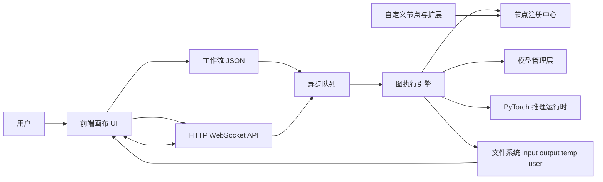
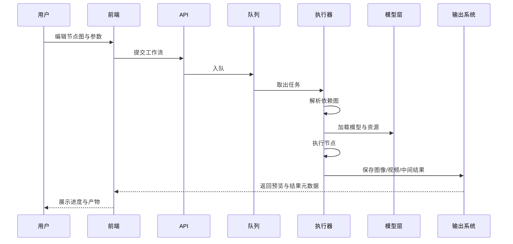
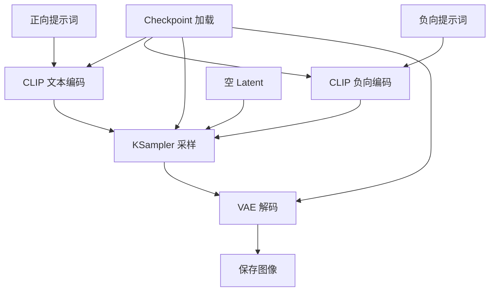
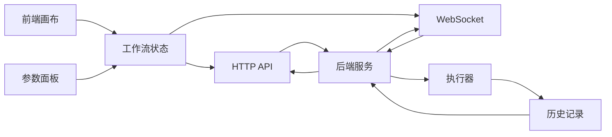
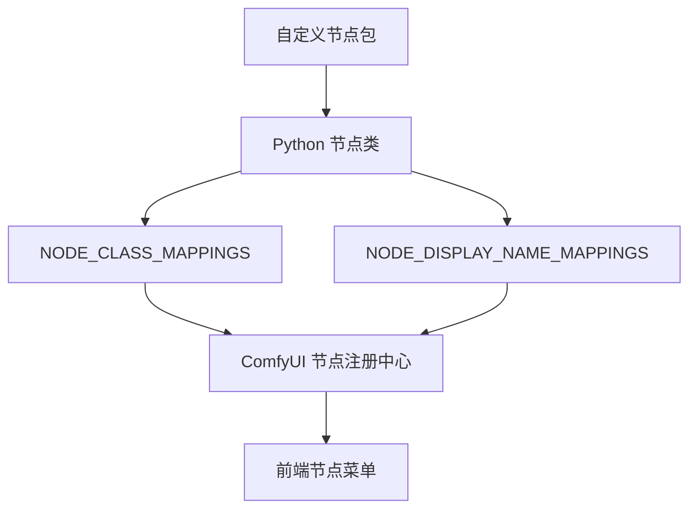
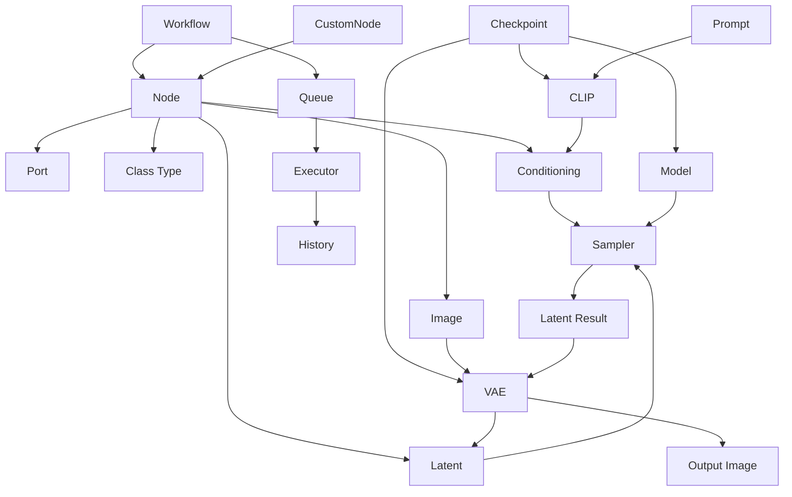
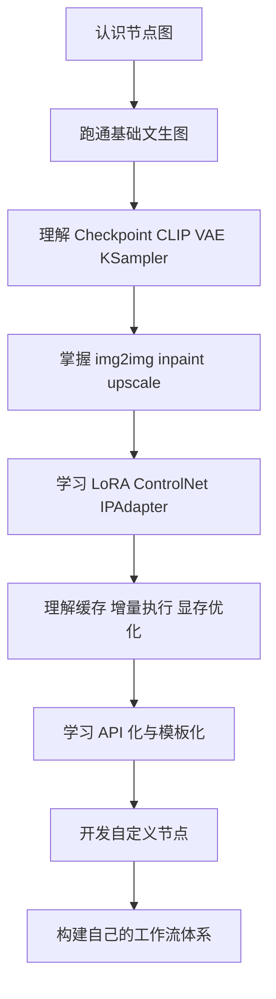

# ComfyUI 技术详解与学习路线

## 1. ComfyUI 是什么

ComfyUI 是一个以有向图和节点编排为核心的生成式 AI 工作流系统。它最初因 Stable Diffusion 工作流而流行，但现在已经扩展为一个通用的多模态推理编排平台，支持图像、视频、音频、3D 与部分外部 API 模型接入。

从工程角度看，ComfyUI 的本质不是“提示词界面”，而是一个具备以下特征的运行时系统：

- 以节点图描述任务
- 以后端执行引擎调度图
- 以模型加载器管理模型资源
- 以前端画布表达依赖关系
- 以队列系统承载异步执行
- 以插件机制扩展节点能力

如果把传统扩散模型 WebUI 理解为“参数表单驱动”，那么 ComfyUI 更像“面向工作流的图计算系统”。

## 2. 核心设计目标

ComfyUI 的技术路线可以概括为五点：

1. **可组合性**：把采样、编码、解码、控制、后处理拆成可自由连接的节点
2. **可复用性**：同一段图可以被保存、分享、复跑、参数化
3. **可扩展性**：通过自定义节点扩展模型、算子、API 和业务逻辑
4. **可追踪性**：图结构天然保留推理链路、参数来源与依赖关系
5. **可优化性**：通过缓存、增量执行、异步队列、显存管理提升运行效率

## 3. 总体技术架构



从分层上看，可以拆成下面几层：

- **表示层**：节点画布、参数面板、连线、模板、历史记录
- **接口层**：HTTP 接口、WebSocket 消息、工作流导入导出
- **编排层**：图解析、拓扑依赖、脏节点识别、增量执行
- **执行层**：节点函数调用、张量流转、采样过程、结果回写
- **资源层**：模型文件、缓存、显存、磁盘目录、预览图
- **扩展层**：自定义节点、前端扩展、管理器、第三方生态

## 4. 关键对象模型

理解 ComfyUI，最重要的是先理解几个“对象”。

### 4.1 工作流

工作流是一个节点图。它包含：

- 节点集合
- 节点输入
- 节点输出
- 节点之间的连接关系
- 每个节点的参数
- 可选的元数据

工作流通常以 JSON 持久化。它既是前端画布状态，也是后端执行描述。

### 4.2 节点

节点是最小计算单元。一个节点通常具备：

- 类名或类型名
- 输入端口定义
- 输出端口定义
- 参数定义
- 执行函数
- 分类信息

一个节点既可以是纯参数节点，也可以是重量级计算节点，例如：

- 模型加载节点
- 文本编码节点
- 采样节点
- 图像保存节点
- 条件控制节点

### 4.3 边与端口

ComfyUI 的连线不是“装饰”，而是严格的数据依赖关系。

- **输入端口**表示一个节点需要什么数据
- **输出端口**表示一个节点产出什么数据
- **边**表示“上游输出作为下游输入”

这决定了执行顺序必须符合依赖图。

### 4.4 执行结果

执行后的结果可能是：

- latent
- image
- mask
- conditioning
- model
- clip
- vae
- text
- 数值或布尔控制值

这些对象在图中流动，形成从输入到输出的完整推理链。

## 5. 工作流生命周期



生命周期一般分为以下阶段：

1. **图构建**：用户在前端建立节点图
2. **序列化**：图被转换为 JSON 描述
3. **入队**：任务被发送到后端队列
4. **解析**：执行器分析依赖和可执行子图
5. **资源准备**：加载 checkpoint、VAE、CLIP、LoRA、ControlNet 等资源
6. **节点执行**：按依赖顺序执行节点
7. **结果持久化**：保存输出文件并记录历史
8. **反馈展示**：前端通过轮询或 WebSocket 获取进度、预览和结果

## 6. 图执行引擎的核心逻辑

ComfyUI 的技术难点在于：它不是简单从上到下执行，而是按“依赖图 + 增量变化”执行。

### 6.1 拓扑依赖

任意一个节点只有在以下条件成立时才可执行：

- 它的所有必要输入都已准备好
- 上游节点已经完成
- 它没有被静音、绕过或从图中断开

这本质上是一个有向无环图的拓扑执行问题。

### 6.2 脏节点与增量执行

ComfyUI 的一个重要优化是：**只重算发生变化的部分**。

如果你修改了：

- 正向提示词
- 采样器步数
- CFG
- 种子

那么并不是所有节点都需要重新执行，只有受影响的节点和其下游依赖节点需要重算。

这背后的工程意义很大：

- 减少重复编码和重复加载
- 降低显存波动
- 缩短迭代时间
- 让复杂图可交互调试

### 6.3 缓存

缓存通常出现在几个层面：

- 节点级输出缓存
- 模型对象缓存
- 前端预览缓存
- 文件级结果复用

缓存命中时，执行器可以跳过某些节点，直接复用已有中间结果。

### 6.4 部分图执行

ComfyUI 只会执行“能够通向有效输出”的部分图。

这意味着：

- 没接到最终输出链的节点可能不会执行
- 断开的测试节点不会浪费算力
- 一个大图里可以并存多个实验支路

## 7. 典型推理链路

下面是最经典的文本生成图像链路。



这个链路的核心逻辑是：

- 加载 checkpoint 后得到 model、clip、vae 等资源对象
- 用 CLIP 对正负提示词做文本编码
- 用 latent 作为扩散起点
- 用采样器迭代去噪得到 latent 结果
- 用 VAE 将 latent 解码成图像
- 把图像保存到输出目录

## 8. 常见技术模块

### 8.1 模型加载层

ComfyUI 支持多种模型资产，常见包括：

- checkpoint
- diffusion model
- VAE
- CLIP / text encoder
- LoRA
- embedding / textual inversion
- ControlNet
- IPAdapter
- upscale model
- video model
- audio model

模型层的职责包括：

- 根据节点请求定位模型文件
- 加载权重到内存或显存
- 维持对象句柄给后续节点复用
- 在设备之间转移和卸载模型

### 8.2 条件系统

扩散模型并不是只看提示词，ComfyUI 里的条件往往是组合式的：

- 文本条件
- 图像条件
- 掩码条件
- 结构条件
- 参考图条件
- 风格条件
- 时间序列条件

条件系统可以理解为“影响采样方向的控制向量集合”。

### 8.3 采样系统

采样节点通常是整条工作流里最核心的执行节点。它负责：

- 接收模型对象
- 接收正负条件
- 接收初始 latent
- 根据 seed、steps、cfg、sampler、scheduler 执行多轮去噪

常见采样概念包括：

- seed
- steps
- cfg
- sampler_name
- scheduler
- denoise
- batch_size

这些参数共同决定质量、风格稳定性、速度和随机性。

### 8.4 Latent 系统

Latent 是压缩后的潜空间表示，不是最终像素图。

其作用是：

- 在更小的空间内进行扩散运算
- 降低计算量
- 允许更高效地完成采样、重绘、局部编辑和放大

很多图像操作在 ComfyUI 中会先转换到 latent 或从 latent 出发。

### 8.5 VAE 系统

VAE 的职责是 latent 与像素空间之间的编码和解码。

- 文生图常见过程是 `latent -> VAE decode -> image`
- 图生图或重绘常见过程是 `image -> VAE encode -> latent`

VAE 会影响：

- 色彩还原
- 细节稳定性
- 编解码误差
- 输出观感

### 8.6 图像 I/O 系统

输入输出目录一般承担这些职责：

- input：用户提供的输入图像
- output：最终生成结果
- temp：临时文件
- user：用户工作流与配置

ComfyUI 的很多外部集成实际上也是围绕文件系统与工作流 JSON 组织的。

### 8.7 预览与历史系统

为了提升交互体验，ComfyUI 会提供：

- 队列状态
- 当前执行节点
- 中间预览
- 输出历史
- 带工作流元数据的图片回溯

这也是它特别适合实验与复现的重要原因。

## 9. 前后端关系



### 9.1 前端职责

前端不只是画图，它还负责：

- 节点创建与布局
- 参数编辑
- 连线校验
- 保存与加载工作流
- 展示队列、历史、预览
- 导出 API 格式工作流

### 9.2 后端职责

后端主要负责：

- 接收工作流
- 排队与调度
- 注册节点
- 执行推理
- 管理模型
- 输出结果与状态

### 9.3 通信模式

典型通信方式通常是：

- HTTP：提交任务、查询历史、读取对象
- WebSocket：推送执行状态、实时进度、预览事件

因此，ComfyUI 同时具备“本地交互 UI”和“可编程推理服务”的双重属性。

## 10. 工作流 JSON 的逻辑结构

API 格式的工作流通常可以抽象为：

```json
{
  "1": {
    "inputs": {
      "seed": 123456,
      "steps": 20
    },
    "class_type": "KSampler",
    "_meta": {
      "title": "KSampler"
    }
  }
}
```

它的逻辑要点是：

- 最外层键通常是节点 ID
- `inputs` 保存参数和值，或对其他节点输出的引用
- `class_type` 指定节点类型
- `_meta` 常用于显示层信息

如果一个输入依赖其他节点，常见表示方式是：

- `[上游节点ID, 输出索引]`

这意味着工作流 JSON 本质上在表达一张“可执行依赖图”。

## 11. 自定义节点机制

自定义节点是 ComfyUI 生态最关键的扩展点之一。

### 11.1 自定义节点解决什么问题

它可以扩展：

- 新模型接入
- 新采样策略
- 新图像处理算法
- 业务系统集成
- 云端 API 调用
- 视频与音频处理
- 数据处理与自动化流程

### 11.2 自定义节点的基本构成

一个自定义节点包通常包含：

- Python 包入口
- 节点类定义
- 输入输出声明
- 节点注册映射
- 可选的前端资源
- 可选的依赖安装文件

### 11.3 节点注册关系



### 11.4 自定义节点开发的关键难点

- 输入输出类型设计
- 计算过程中的张量维度管理
- 显存占用控制
- 依赖库安装兼容性
- 与前端节点定义的一致性
- 跟随 ComfyUI 核心版本变化同步升级

## 12. 队列与异步执行

ComfyUI 并不是“点击就同步卡死直到结束”的单次阻塞系统，而是带队列的异步系统。

队列层通常承担：

- 排队
- 插队
- 取消
- 批量任务处理
- 历史记录归档

这使得它更适合：

- 批量出图
- 服务化调用
- 多任务实验
- 自动化脚本集成

## 13. API 化与服务化能力

ComfyUI 在工程上有很高价值的一点，是它不只是桌面工具，也是一个工作流后端。

### 13.1 常见 API 使用方式

- 提交工作流 JSON
- 上传输入图像
- 监听进度
- 拉取历史记录
- 获取输出文件

### 13.2 适合的场景

- 内部图片生成服务
- 自动出图脚本
- SaaS 工作流后端
- 企业内部 AI 生产流水线
- 与聊天机器人、内容系统、审核系统串联

### 13.3 服务化时要关心的问题

- 并发
- 队列长度
- 显存竞争
- 模型热加载策略
- 输出目录清理
- 权限与隔离
- 自定义节点安全性

## 14. 显存、内存与性能优化

ComfyUI 的高灵活性也意味着需要较强的资源管理能力。

### 14.1 资源压力主要来自

- 大模型权重加载
- 高分辨率 latent
- 长视频帧序列
- 批量采样
- 多 ControlNet / 多条件并发

### 14.2 常见优化手段

- 只重算变动节点
- 对模型做自动卸载与转移
- 使用更轻量的 VAE/预览策略
- 分块处理
- 降低 batch_size
- 使用合适的采样步数
- 使用更适合设备的 PyTorch 后端

### 14.3 性能思维

在 ComfyUI 中，优化不只是“换更强显卡”，更是：

- 减少无效节点
- 控制数据尺寸
- 避免重复编码
- 合理拆分工作流
- 明确哪个节点是瓶颈

## 15. 常见工作流类型

### 15.1 文生图

最基础，也最适合理解模型装配逻辑。

### 15.2 图生图

在已有图像基础上重新编码后采样，强调 denoise 强度与结构保留。

### 15.3 局部重绘

核心是 mask、VAE encode、局部条件控制和采样区域管理。

### 15.4 放大与细化

常见是先低分辨率生成，再走 upscale、重采样、细节增强链路。

### 15.5 ControlNet 工作流

通过结构条件控制构图，例如：

- 边缘
- 深度
- 姿态
- 法线
- 语义图

### 15.6 IPAdapter / 参考图风格迁移

强调“参考图影响”和“文本提示影响”的联合控制。

### 15.7 视频工作流

比图像更复杂，因为会引入：

- 帧序列
- 时间一致性
- 视频编码解码
- 更高的显存与缓存压力

## 16. 专业术语与逻辑关系

下表适合作为学习 ComfyUI 的术语地图。

| 术语 | 含义 | 在 ComfyUI 中的位置 | 与谁强相关 |
| --- | --- | --- | --- |
| Workflow | 工作流图 | 全局对象 | Node、Edge、JSON、Queue |
| Node | 节点 | 最小计算单元 | Input、Output、Class Type |
| Edge | 连线/依赖边 | 节点关系 | Port、Execution Order |
| Port | 端口 | 输入输出接口 | Type、Connection |
| Class Type | 节点类型标识 | JSON 与注册中心 | Node Registry |
| Conditioning | 条件表示 | 文本/图像控制核心 | CLIP、ControlNet、Sampler |
| Latent | 潜空间表示 | 采样主数据 | VAE、Sampler |
| VAE | 编解码器 | latent 与 image 转换 | Encode、Decode |
| CLIP | 文本编码器 | 提示词转条件 | Prompt、Checkpoint |
| Checkpoint | 基础权重包 | 模型入口 | Model、CLIP、VAE |
| LoRA | 轻量增量权重 | 风格/角色适配 | Checkpoint、Sampler |
| Seed | 随机种子 | 采样初值 | Reproducibility |
| CFG | 提示词引导强度 | 采样控制参数 | Prompt、Sampler |
| Sampler | 采样算法 | 去噪核心 | Scheduler、Steps、Denoise |
| Scheduler | 噪声调度策略 | 采样过程参数 | Sampler、Steps |
| Denoise | 去噪强度 | img2img/inpaint 常用 | Latent、Sampler |
| ControlNet | 结构控制模型 | 条件增强模块 | Conditioning、Image Guidance |
| IPAdapter | 图像参考适配器 | 参考图控制 | Vision Encoder、Conditioning |
| Custom Node | 自定义节点 | 扩展机制 | Registry、Python Package |
| Queue | 队列 | 异步任务管理 | Executor、History |
| History | 历史记录 | 结果追踪 | Output、Metadata |
| Metadata | 元数据 | 回溯与复现 | PNG、Workflow、Seed |

## 17. 一张术语关系图



## 18. ComfyUI 与其他工具的本质区别

从技术模型上看，ComfyUI 与参数面板式 WebUI 的区别主要有：

- 它把“推理过程”显式建模成图
- 它把“模型装配”暴露给用户
- 它把“复现链路”保存在工作流里
- 它更像 AI Pipeline Builder，而不是单一出图页面

所以 ComfyUI 学习难度更高，但一旦掌握，其扩展上限也明显更高。

## 19. 适合怎样的人学习

### 19.1 偏创作者

适合先学：

- 基础文生图
- LoRA
- ControlNet
- 放大与重绘

### 19.2 偏工程师

适合重点学：

- 工作流 JSON
- API 调用
- 自定义节点
- 批处理与服务化

### 19.3 偏研究者

适合重点学：

- 采样器与调度器
- 条件组合
- 模型结构差异
- 多模态工作流设计

## 20. 推荐学习步骤

### 第 1 阶段：建立整体认知

目标是理解“ComfyUI 不是一个模型，而是一个工作流系统”。

建议学习内容：

- 认识节点、端口、连线、工作流
- 跑通最简单的文生图
- 理解 checkpoint、CLIP、VAE、KSampler 的关系

产出标准：

- 能看懂一个最小文生图工作流
- 能改提示词、种子、步数、CFG

### 第 2 阶段：掌握基础工作流

建议学习内容：

- txt2img
- img2img
- inpaint
- upscale

产出标准：

- 能自己从零搭一套基础出图图谱
- 能判断每个节点在链路中的作用

### 第 3 阶段：掌握条件控制

建议学习内容：

- ControlNet
- IPAdapter
- LoRA
- mask 与区域控制

产出标准：

- 能解释“提示词控制”和“参考条件控制”的差异
- 能按需求让构图、风格、人物一致性更稳定

### 第 4 阶段：理解执行与优化

建议学习内容：

- 为什么只重算部分节点
- 哪些节点最吃显存
- latent 尺寸与速度的关系
- 模型切换与缓存复用

产出标准：

- 能定位慢点
- 能压缩无效计算
- 能设计更稳定的大图工作流

### 第 5 阶段：面向工程化使用

建议学习内容：

- 导出 API 格式工作流
- 用脚本提交工作流
- 管理输入输出目录
- 设计可参数化的模板工作流

产出标准：

- 能把 ComfyUI 当作后端服务使用
- 能对接其他应用或自动化系统

### 第 6 阶段：进入扩展开发

建议学习内容：

- 自定义节点结构
- Python 节点开发
- 前端扩展资源
- 版本兼容与依赖管理

产出标准：

- 能开发自己的节点
- 能把业务能力封装成图中可复用组件

## 21. 建议的学习顺序图



## 22. 学习中的常见误区

### 22.1 只记节点名字，不理解数据流

真正需要理解的是：

- 数据从哪里来
- 为什么传到这里
- 为什么这个节点依赖那个节点

### 22.2 只关心提示词，不理解模型装配

ComfyUI 的强大来自模型与条件装配，不只是 prompt engineering。

### 22.3 盲目堆节点

节点越多不代表效果越好，复杂图必须服务于明确目标。

### 22.4 不关注复现性

需要同时关注：

- seed
- 模型版本
- 节点版本
- 工作流 JSON
- 输出元数据

## 23. 从“会用”到“真正掌握”的标志

如果你已经能做到下面这些，基本就算真正进入 ComfyUI 的技术层了：

- 能看懂别人分享的工作流
- 能删除无效节点并保持图仍可运行
- 能判断一条链路里谁负责模型、谁负责条件、谁负责采样、谁负责输出
- 能把图改造成更适合自己场景的版本
- 能用 API 或脚本批量执行工作流
- 能开始尝试编写自定义节点

## 24. 最后总结

ComfyUI 的本质可以浓缩成一句话：

> **ComfyUI 是一个围绕生成式模型推理而设计的、以节点图为核心抽象的工作流执行系统。**

它的技术价值不只是“能出图”，而在于：

- 它把复杂推理链条显式化
- 它把模型能力组合化
- 它把实验过程工程化
- 它把生成任务服务化

如果你的目标只是偶尔出图，ComfyUI 可能显得复杂。

但如果你的目标是：

- 搭建稳定的生成流程
- 理解扩散模型链路
- 复现和分享复杂工作流
- 构建自动化、多模态、可扩展的 AI 生产系统

那么 ComfyUI 是非常值得系统学习的工具。
